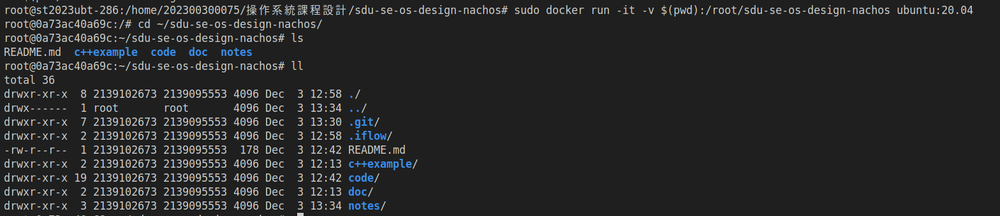
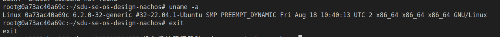
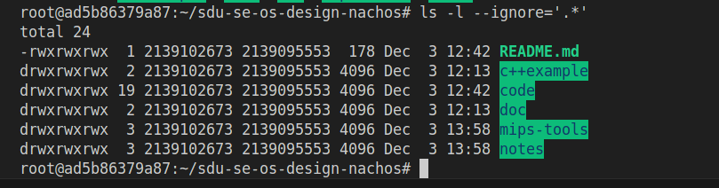
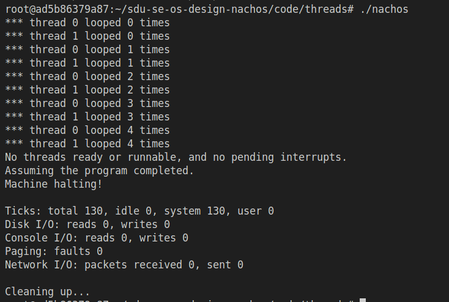
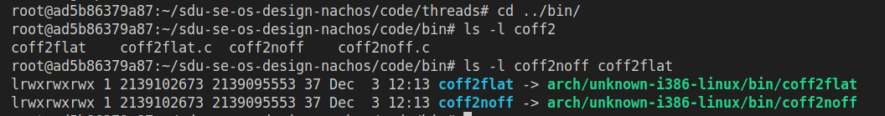

# 实验一

开发环境：

  硬件信息
   - CPU: AMD EPYC 7543 32-Core Processor (4核心, 4线程)
   - 架构: x86_64
   - 内存: 未显示，但系统运行正常
   - 虚拟化: VMware虚拟机环境
   - 缓存: L1d/L1i缓存各128 KiB, L2缓存2 MiB, L3缓存1 GiB

  系统版本
   - 操作系统: Ubuntu Linux 22.04 (基于Linux 6.2.0-32-generic)
   - 内核版本: 6.2.0-32-generic #32~22.04.1-Ubuntu SMP 
     PREEMPT_DYNAMIC
   - 架构: x86_64 GNU/Linux

  开发工具版本
   - GCC编译器: 11.4.0 (Ubuntu 11.4.0-1ubuntu1~22.04)
   - Make工具: GNU Make 4.3
   - Git版本控制: 2.52.0
   - Vim编辑器: 8.2 (2019 Dec 12, with patches 1-3995)
   - VSCode编辑器: 1.106.3 (Commit: 
     bf9252a2fb45be6893dd8870c0bf37e2e1766d61)

运行环境：Ubuntu 20.04.3 LTS amd64


### 运行环境配置

本实验使用Docker容器进行搭建Ubuntu 20.04 LTS amd64的运行环境。

步骤 1: 拉取 Ubuntu 20.04 镜像

```bash
sudo docker pull ubuntu:20.04
```


步骤 2: 创建容器并挂载当前目录

```bash
sudo docker run -d -v $(pwd):/root/sdu-se-os-design-nachos --name nachos-container ubuntu:20.04 tail -f /dev/null
```

创建后可以看到目录正确挂载：



查看内核版本并退出



步骤 3: 进入容器的 bash

```bash
sudo docker exec -it nachos-container bash
```

更新Ubuntu的源

```bash
sudo apt update
```

安装gcc，g++，make，及为编译并运行32位应用需要的一些gcc库

```bash
sudo apt install -y gcc
sudo apt install -y g++
sudo apt install -y make
sudo apt install -y gcc-multilib g++-multilib
```


这是项目目录的截图



其中将mip工具的压缩包拷贝到mips-tools


### 安装MIPS的交叉编译器

```
sudo tar -xzvf ./gcc-2.8.1-mips.tar.gz
```


### 测试Nachos threads

编译：

```
cd ~/sdu-se-os-design-nachos/code/threads/
make clean
make
```


运行：

```
./nachos
```

显示如下页：



确认转换工具有x权限

