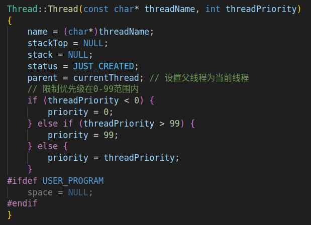
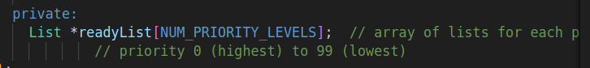
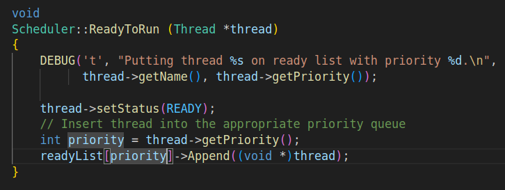
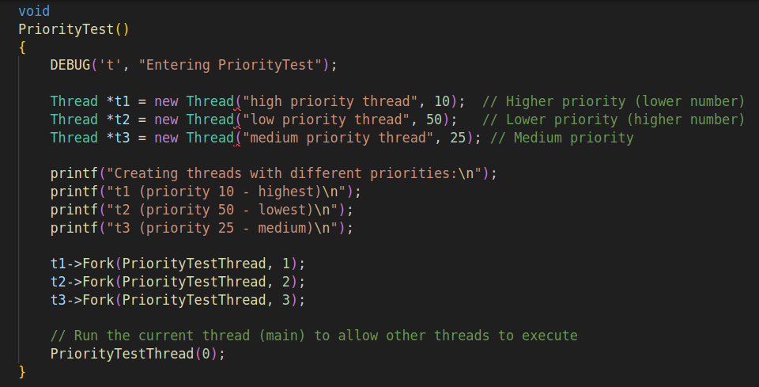
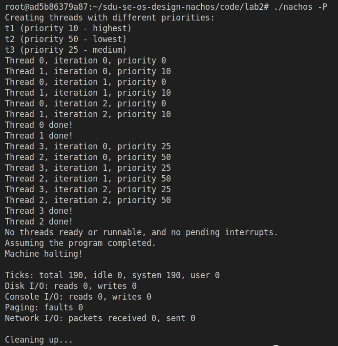
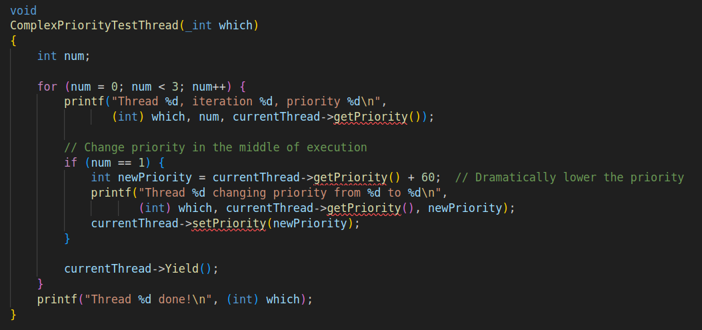
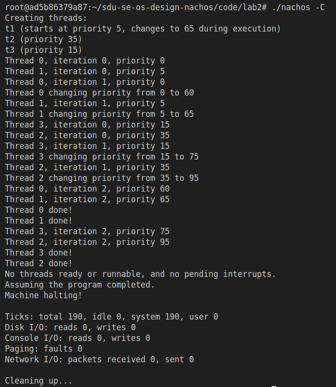
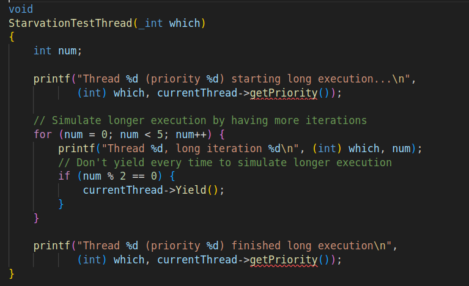
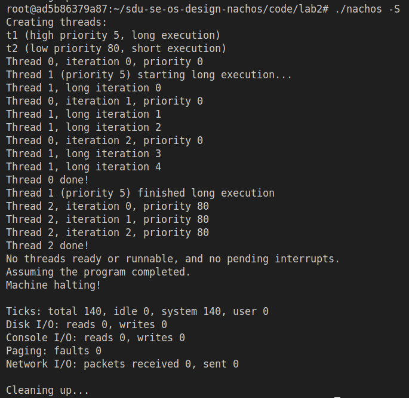

# 实验2 具有优先级的线程调度

## 1. Nachos原有线程调度策略分析

Nachos原有线程调度策略采用非常简单的FIFO（先进先出）队列机制。其核心实现主要体现在scheduler.h和scheduler.cc文件中，调度器使用List类型的readyList作为就绪队列。在具体操作上，ReadyToRun()函数使用Append()方法将线程添加到队列末尾，而FindNextToRun()函数则使用Remove()方法从队列头部取出线程。

这种纯粹的FIFO策略没有优先级概念，先就绪的线程先执行。虽然实现简单，但在实际应用中显得过于基础，无法区分不同任务的紧急程度，也无法满足实时系统或需要优先级处理的应用场景。

## 2. 具有静态优先级的非抢占式线程调度策略实现

### 2.1 实现方案

为了实现优先级调度，我们采用了全面的设计方案。首先扩展Thread类，添加priority成员变量存储线程优先级，同时添加parent成员变量支持优先级继承。我们设计了带优先级参数的构造函数，并实现了getPriority()和setPriority()方法，确保优先级范围限制在0-99之间。

在调度器方面，我们使用多级优先级队列替代单个排序列表，按优先级级别将线程分配到不同队列，从高优先级到低优先级依次查找可运行线程。这种设计既保持了原有系统的简洁性，又引入了优先级调度的灵活性。

### 2.2 代码修改

#### 2.2.1 Thread类扩展

在thread.h中，我们添加了Thread(const char* debugName, int priority)构造函数，以及int getPriority()获取优先级方法和void setPriority(int newPriority)设置优先级方法，后者包含了范围检查功能。同时还添加了Thread* getParent()和setParent()方法，以及int priority和Thread* parent成员变量。

在thread.cc中，我们实现了带优先级参数的构造函数，并添加了优先级继承逻辑，使新线程继承创建它的线程的优先级。setPriority方法确保优先级在0-99范围内，构造函数中设置父线程为当前线程。

#### 2.2.2 调度器修改

在scheduler.h中，我们定义了NUM_PRIORITY_LEVELS常量为100，将readyList改为readyList[NUM_PRIORITY_LEVELS]数组，每个优先级级别对应一个队列。

在scheduler.cc中，我们修改了ReadyToRun()函数，将线程添加到对应优先级的队列中，并实现了FindNextToRun()函数，从最高优先级（0）到最低优先级（99）依次查找可运行线程。构造函数和析构函数负责初始化和销毁所有优先级队列。

### 2.3 优先级设计

我们的优先级设计遵循明确的原则：优先级数值越小，优先级越高，0为最高优先级，99为最低优先级。默认优先级设置为当前线程的优先级，实现了优先级继承。我们设置了优先级范围限制，确保0-99范围内的值有效，超出范围的值会被调整到范围内。整个系统采用非抢占式调度，线程主动让出CPU时才进行调度。

这种设计与Linux的优先级概念相似，但简化了范围，便于教学和理解。通过优先级继承机制，我们确保了父子线程之间的优先级关系，这对于系统资源管理和进程控制具有重要意义。

## 3. Fork后优先级继承机制

### 3.1 优先级继承实现

在多任务系统中，优先级继承是一个重要概念，它解决了父子线程之间的优先级关系问题。我们的实现方案中，创建新线程时，新线程会继承创建它的线程（父线程）的优先级。在Thread构造函数中实现priority = currentThread->getPriority()的逻辑，并添加parent指针记录父线程，便于实现优先级继承。

这种设计模仿了Linux系统的fork机制，在Linux中，子进程会继承父进程的调度参数，包括优先级。这种继承机制确保了系统的一致性和可预测性。

### 3.2 使用示例

用户可以根据需要灵活地控制线程的优先级，既可以利用默认的优先级继承，也可以显式指定优先级。例如，可以使用Thread *t = new Thread("child thread")来继承当前线程的优先级，或者使用Thread *t = new Thread("child thread", 5)来指定特定优先级（范围0-99）。

## 4. 多级队列优化

### 4.1 分层队列实现

传统的优先级调度通常使用排序列表，但这在性能上存在瓶颈。我们采用了多级队列的设计方案，使用100个独立队列（对应优先级0-99）替代原来的单个排序列表。这种设计使得ReadyToRun()操作的时间复杂度变为O(1)，直接添加到对应优先级队列末尾，而FindNextToRun()操作在最坏情况下为O(P)，P为优先级级别数（100），平均性能更好，同时保持了优先级调度的正确性。

这种设计借鉴了Linux内核中的调度队列概念，但进行了简化以适应教学需求。每个优先级级别对应一个独立的FIFO队列，这使得插入操作非常高效。

### 4.2 性能优势

多级队列设计带来了显著的性能提升。插入操作从O(n)优化到O(1)，不再需要遍历排序列表找到正确位置。查找最高优先级线程更加高效，按优先级顺序查找，找到第一个非空队列即可。虽然内存使用略微增加，需要维护100个队列，但每个队列通常较短。

在实际系统中，这种性能优化尤为重要，因为线程调度是操作系统中最频繁的操作之一。通过将插入操作从线性时间复杂度降低到常数时间复杂度，我们显著减少了调度开销。

## 5. 上下文切换次数分析与优化

### 5.1 上下文切换分析

上下文切换是多任务系统中的核心操作，也是性能开销较大的操作。我们对Nachos的上下文切换进行了详细分析。通过./nachos -d t命令运行，可以观察线程切换信息。线程调用Yield()时，如果就绪队列中有其他线程，则发生上下文切换。理论上，每次输出后调用Yield()可能引起切换，但实际切换次数取决于就绪队列状态。

通过分析发现，上下文切换的频率与线程调度策略密切相关。在优先级调度中，高优先级线程的频繁就绪可能导致更多的上下文切换。

### 5.2 优化策略

为了减少不必要的上下文切换，我们采用了多种优化策略。原有的Yield()函数已经实现了优化，只有在就绪队列中有其他就绪线程时才执行上下文切换。Yield()函数中的判断逻辑if (nextThread != NULL)确保没有其他就绪线程时不进行切换。新的多级队列实现进一步优化了调度器性能。

这些优化减少了不必要的上下文切换，提高了系统整体性能。在实际操作系统中，上下文切换优化的重要性不言而喻，因为它直接影响到系统的响应速度和吞吐量。

## 6. 优先级调度的老化(aging)实现方法

### 6.1 老化机制设计

优先级调度虽然能够体现任务的重要性，但也可能导致低优先级任务长时间得不到执行，即"饥饿"现象。为了解决这个问题，我们设计了老化机制。老化机制是为了解决低优先级线程"饥饿"问题，通过随着时间的推移提高等待时间长的线程优先级。这种机制确保了即使优先级较低的任务，在等待足够长的时间后也能获得执行机会。

### 6.2 具体实现方法

在数据结构扩展方面，可以在Thread类中添加creationTime或lastRunTime字段记录线程等待时间，也可以添加waitingTime字段记录累积等待时间。

在优先级动态调整算法方面，可以在就绪队列中查找线程时，根据等待时间动态调整优先级。实现策略上，可以在调度器的ReadyToRun函数中更新线程的等待时间，定期执行优先级调整，防止长时间等待的低优先级线程无法执行。

在关键代码结构方面，可以在scheduler.h中添加UpdateAging()方法，在scheduler.cc中实现老化算法。

### 6.3 老化参数设计

老化机制的效果取决于参数的合理设置。AGING_FACTOR是老化速率参数，控制优先级提升速度。MAX_AGING是最大老化值，防止优先级无限提升。AGING_INTERVAL是老化检查间隔，可在系统时钟中断中执行。

这些参数需要根据具体应用场景进行调整。在实时系统中，可能需要较小的老化因子；而在通用系统中，可以采用较大的老化因子以确保公平性。

## 7. 测试代码逻辑与测试过程

### 7.1 优先级测试 (PriorityTest)

#### 测试代码逻辑

PriorityTest测试函数创建了3个具有不同优先级的线程：
- t1：优先级为10（较高优先级）
- t2：优先级为50（较低优先级）
- t3：优先级为25（中等优先级）

PriorityTestThread函数执行一个循环，在每次迭代中打印线程信息并调用Yield()让出CPU。每个线程循环3次，每次打印当前线程编号、迭代次数和当前优先级。由于使用优先级调度，理论上优先级数值越小（优先级越高）的线程会优先执行。

#### 测试过程
1. 创建3个不同优先级的线程（t1优先级10、t2优先级50、t3优先级25）
2. 使用Fork()函数分别启动这3个线程
3. 主线程也调用PriorityTestThread函数执行
4. 观察执行顺序，高优先级线程应优先获得CPU时间

#### 命令
运行 ./nachos -P 执行此测试

#### 運行結果

#### 结果分析

PriorityTest的运行结果清晰地展示了Nachos优先级调度机制的有效性。

测试开始时，主线程（Thread 0，优先级0）首先执行，这是因为它在创建其他线程前就已经开始运行。随后，系统按照优先级从高到低的顺序调度线程：优先级为10的线程1（Thread 1）最先获得CPU时间并完成了全部3次迭代，接着是优先级为25的线程3（Thread 3）执行，最后优先级为50的线程2（Thread 2）获得执行机会。

整个执行过程严格遵循了"数值越小优先级越高"的调度规则，高优先级线程始终优先于低优先级线程执行，充分验证了 Nachos 优先级调度策略的正确性和有效性。

  

### 7.2 复杂优先级测试 (ComplexPriorityTest)

#### 测试代码逻辑

ComplexPriorityTest测试函数创建了3个线程，并在执行过程中动态改变线程优先级：

- t1：初始优先级为5（较高优先级），在执行到第2次迭代时会将自己的优先级增加60（变为65，较低优先级）
- t2：优先级为35（中等优先级），保持不变
- t3：优先级为15（较高优先级），保持不变

ComplexPriorityTestThread函数在执行过程中会检查迭代次数，当num==1时（即第二次迭代），会将当前线程的优先级增加60，然后继续执行剩余的迭代。

#### 测试过程

1. 创建3个具有不同初始优先级的线程
2. 线程启动后，t1在执行过程中会动态调整自己的优先级
3. 观察调度器如何处理运行时优先级变化
4. 验证调度器是否能正确响应运行时的优先级变更

#### 命令

运行 ./nachos -C 执行此测试

#### 執行結果

#### 結果分析

ComplexPriorityTest的运行结果生动展示了Nachos系统对运行时优先级变化的响应能力。

测试初期，主线程（Thread 0，优先级0）首先启动，随后线程1（优先级5）获得执行机会，这完全符合初始的优先级调度规则。关

键的转折点出现在第二次迭代时，所有线程都进行了优先级调整：主线程从0变为60，线程1从5变为65，线程3从15变为75，线程2从35变为95。这种动态变化立即影响了后续的调度决策，但由于所有线程优先级都大幅降低且相对关系保持稳定，整体的调度模式基本延续。

特别值得注意的是，系统成功实现了运行时优先级调整，且非抢占式调度机制确保了每个线程能够完整完成当前迭代后再进行重新调度。这个测试充分验证了Nachos优先级调度系统具备处理动态优先级变化的能力，体现了现代操作系统中动态调度的重要特性。

### 7.3 饥饿测试 (StarvationTest)

#### 测试代码逻辑

StarvationTest测试函数用于验证低优先级线程是否会被高优先级线程饿死：
- t1：高优先级线程（优先级为5），执行较长的任务（使用StarvationTestThread函数，5次循环，偶数次循环调用Yield()）
- t2：低优先级线程（优先级为80），执行较短的任务（使用PriorityTestThread函数，3次循环，每次循环后调用Yield()）

StarvationTestThread函数模拟长时间执行任务，通过5次迭代和选择性的Yield调用（只在偶数次迭代时调用Yield()），来模拟CPU密集型任务。这样可以测试在非抢占式调度中，低优先级线程是否能获得执行机会。

#### 测试过程
1. 创建一个高优先级长执行线程和一个低优先级短执行线程
2. 观察低优先级线程是否有机会执行
3. 验证调度器是否能防止饥饿现象
4. 确认即使是低优先级的线程也能获得执行机会

#### 命令
运行 ./nachos -S 执行此测试

#### 運行結果

#### 結果分析

StarvationTest的运行结果深入揭示了Nachos非抢占式优先级调度中饥饿现象的实际表现。

测试开始后，主线程（Thread 0，优先级0）和高优先级线程1（优先级5）首先获得执行机会，两者交替运行，充分体现了非抢占式调度的特点。线程1执行了5次长时间迭代，但通过策略性的Yield()调用（仅在偶数次迭代时调用），精确控制了CPU让出的时机。

在这个过程中，主线程（优先级0）能够在线程1调用Yield()时获得执行机会，而低优先级线程2（优先级80）则被完全延迟，直到线程1完成所有长时间任务后才开始执行。这种调度模式清晰地展示了优先级对执行顺序的强烈影响：高优先级线程确实能够长时间占用CPU，导致低优先级线程被显著延迟。

然而，关键的是线程2最终获得了执行机会并完成了3次迭代，这证明Nachos的非抢占式调度虽然会延迟低优先级线程，但不会导致永久饥饿。整个测试过程验证了系统的基本公平性，同时也展示了非抢占式调度中线程通过控制Yield()调用时机来影响调度行为的精妙机制。

## 8. 实验总结

通过本次实验，我们成功实现了具有静态优先级的非抢占式线程调度策略，取得了多项重要成果。我们扩展了Thread类，支持优先级设置和继承，实现了Linux风格的优先级继承机制，确保了父子线程之间的优先级关系。同时实现了优先级范围限制，通过范围检查，确保优先级始终在有效范围内。

我们修改了Scheduler类，使用多级优先级队列进行调度，采用多级队列设计，显著提高了调度器性能。通过优化，我们将插入操作从O(n)优化到O(1)，将线性时间复杂度的插入操作优化为常数时间复杂度。在引入新功能的同时，我们保持了原有Yield机制的优化特性，并为后续实现老化机制提供了架构基础。

我们还设计并实现了三种测试用例，用于验证优先级调度、动态优先级调整和防止饥饿等功能的正确性。PriorityTest验证了基本的优先级调度功能，ComplexPriorityTest测试了运行时优先级变化的处理，StarvationTest验证了系统不会让低优先级线程饿死。

这些改进不仅提高了Nachos系统的调度能力，也加深了我们对操作系统调度机制的理解。通过实际编码实现，我们掌握了优先级调度、优先级继承、多级队列等重要概念，为后续深入学习操作系统打下了坚实基础。

实验过程中，我们也遇到了一些挑战，如如何平衡性能与功能、如何确保代码的可维护性等。这些经验对于未来的系统开发同样具有借鉴意义。

