# 实验3 使用信号量解决N线程屏障问题

## 实验内容
使用操作系统信号量机制，编写程序解决N线程屏障问题。包括：

## 1. Nachos信号量实现分析

Nachos中的信号量是一种经典的同步原语，用于解决多线程并发问题。信号量的核心思想是通过一个非负整数值来控制对共享资源的访问，提供P()和V()两个原子操作。P()操作（也称为wait或down）用于等待信号量值大于0，然后将其减1；V()操作（也称为signal或up）用于将信号量值加1，并可能唤醒等待的线程。

在Nachos的实现中，信号量由Semaphore类定义，其核心数据成员包括信号量名称、当前值和等待队列。信号量名称用于调试目的，当前值始终为非负整数，等待队列则存放因P()操作而阻塞的线程。

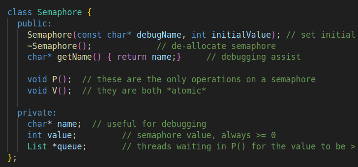

P()操作是信号量中最复杂的操作，其实现需要解决原子性和线程阻塞两个关键问题。Nachos通过关闭中断来保证操作的原子性，这是基于单处理器环境的假设。P()操作的执行流程首先关闭中断确保整个操作的原子性，然后检查信号量值是否为0，如果为0表示资源不可用，就将当前线程加入等待队列并调用Sleep()使其阻塞；如果资源可用，则将信号量值减1表示占用了一个资源单位，最后恢复中断状态使其他线程可以继续执行。

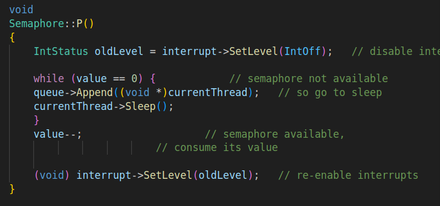

这种实现方式的关键在于通过`interrupt->SetLevel(IntOff)`关闭中断确保在检查信号量值和可能阻塞之间不会有其他线程干扰，调用`currentThread->Sleep()`使线程放弃CPU进入阻塞状态，以及使用List数据结构管理等待的线程，支持FIFO调度策略。

V()操作相对简单，主要负责释放资源并可能唤醒等待的线程。其实现同样需要保证原子性，但逻辑更为直接。V()操作首先关闭中断保证原子性，然后从等待队列中取出一个线程（如果有的话），如果有等待线程就将其状态设置为就绪并放入就绪队列，接着将信号量值加1表示释放了一个资源单位，最后恢复中断状态。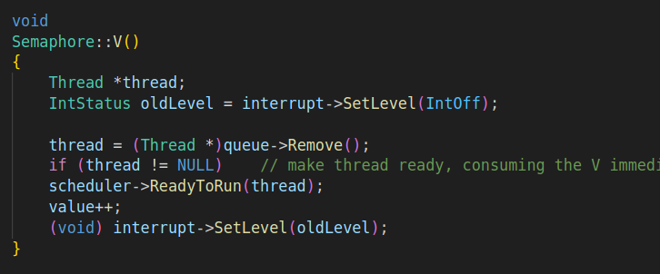

V()操作的实现特点包括每次只唤醒一个等待线程遵循公平性原则，先唤醒线程再增加信号量值确保被唤醒的线程能够立即获得资源，以及通过`scheduler->ReadyToRun(thread)`将被唤醒的线程放入就绪队列。

Nachos提供了三种主要的同步原语：信号量、锁(Lock)和条件变量(Condition)。其中，信号量是最基础的同步机制，锁和条件变量都可以基于信号量实现。锁的实现直接使用了信号量

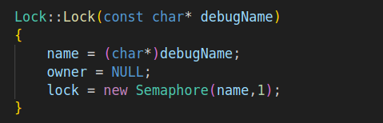

这种设计体现了同步原语的层次关系：信号量是最基础的同步机制，可以解决各种同步问题；锁是基于信号量实现的互斥机制，增加了所有权概念；条件变量用于复杂的线程同步场景，通常与锁配合使用。

## 2. Nachos中并发线程的创建与运行机制

在Nachos中，线程的创建是一个精心设计的过程，涉及内存分配、栈初始化和调度器集成等多个环节。线程创建的核心是Thread类的Fork()方法，它实现了从线程对象到可执行实体的转换。线程创建的基本流程包括创建Thread对象初始化线程控制块，调用Fork()方法指定线程要执行的函数和参数，在Fork()内部调用StackAllocate()分配并初始化线程栈，最后将线程放入就绪队列等待调度器调度。

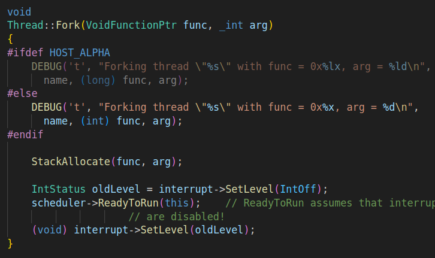

StackAllocate()是线程创建过程中最关键的部分，它负责设置线程开始执行时的寄存器状态。这个过程模拟了真实操作系统中线程上下文的初始化。栈初始化的核心步骤包括为线程分配栈空间（大小由StackSize定义），在栈顶设置栈溢出检测标记(STACK_FENCEPOST)，以及设置线程开始执行时的寄存器状态。寄存器状态的设置包括PC寄存器指向ThreadRoot函数（线程入口点），启动PC指向InterruptEnable函数（启用中断），初始PC指向用户指定的函数，函数参数传递给用户函数的参数，完成PC指向ThreadFinish函数（线程结束处理）。

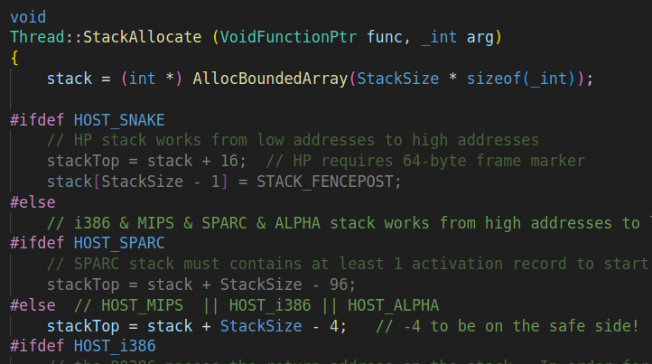

这种设计确保了线程被调度时能够按照预定的流程执行：首先执行ThreadRoot函数进行线程初始化，然后调用InterruptEnable启用中断，接着执行用户指定的函数，最后调用ThreadFinish进行清理工作。

Nachos的线程调度基于优先级队列（在实验2中已实现），调度器负责从就绪队列中选择下一个要运行的线程。线程的并发执行实际上是通过快速的上下文切换实现的。线程调度的关键机制包括调度器维护多个优先级队列按优先级顺序调度线程，通过SWITCH汇编函数实现线程间的快速切换，以及通过定时器中断实现时间片轮转调度。

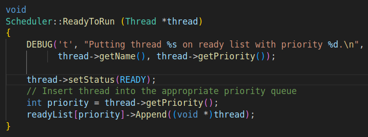

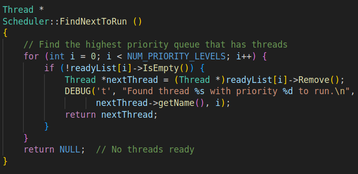

并发执行的实现依赖于中断系统，定时器中断定期触发强制当前线程让出CPU，中断处理函数检查是否有其他就绪线程需要执行，如果有则通过YieldOnReturn标记在返回时进行线程切换。

Nachos中的线程并发实际上只实现了基于线程主动让出的非抢占式调度机制。通过分析源码可以发现，虽然Nachos提供了定时器中断和-rs选项，但这些机制并不能实现真正的抢占式调度。定时器中断处理函数TimerInterruptHandler只会设置YieldOnReturn标记，但在Nachos的实现中，这个标记并没有被自动检查和处理（大概是留了一個接口，留下爲了以後的實現）。只有当线程主动调用Yield()、Sleep()或Finish()等函数时，才会发生实际的线程切换。

从Yield()函数的实现可以看出，线程切换的逻辑是：首先检查就绪队列中是否有其他线程，如果有才执行SWITCH进行上下文切换。如果就绪队列为空，即使设置了YieldOnReturn标记，也不会发生切换。这意味着高优先级线程就绪时并不能立即抢占当前运行的低优先级线程。

在实验3中，我使用-rs选项来测试N线程屏障的实现。通过不同的随机数种子(`./nachos -rs seed`)，可以在系统调用中随机插入Yield()调用，模拟各种线程调度顺序。虽然这不是真正的抢占式并发，但这种随机Yield机制仍然能够有效地暴露多线程同步中的潜在问题，如竞争条件、死锁等。

中断系统在Nachos中主要负责时间管理和事件调度，而非实现抢占式调度。OneTick()函数推进系统时间，CheckIfDue()函数按时间顺序处理待处理中断。定时器中断会定期触发，但其作用主要是为系统提供时间基准，而不是强制剥夺当前线程的CPU使用权。

Nachos的这种非抢占式设计简化了同步问题的处理，避免了复杂的抢占式同步机制。对于教学目的而言，这种设计有助于学生理解基本的调度概念和同步原语，而不会被复杂的抢占机制分散注意力。同时，通过随机Yield机制，Nachos仍然为测试复杂的同步机制（如N线程屏障）提供了足够真实的环境。

## 3. N线程屏障实现与测试

按照"The Little Book of Semaphores"中3.6.4小节的实现方案，我设计了一个N线程屏障类Barrier。该类使用两个信号量实现屏障功能：mutex信号量用于保护共享变量，barrier信号量用于控制线程通过屏障。Barrier类的核心数据成员包括需要等待的线程总数、已到达屏障的线程数、互斥信号量和屏障信号量。

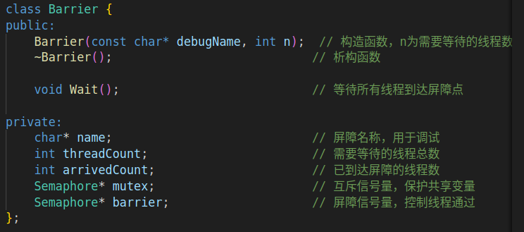

屏障的Wait()方法实现了完整的屏障同步逻辑，首先在rendezvous点执行rendezvous，然后通过mutex信号量保护增加arrivedCount计数，检查是否所有线程都已到达，如果是则唤醒屏障，在屏障点等待通过P()操作阻塞，使用V()操作实现旋转门模式唤醒下一个等待的线程，最后所有线程通过后到达critical point。

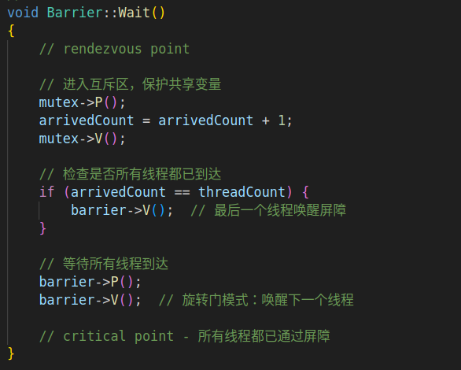

为了测试N线程屏障的正确性，我设计了一个包含10个工作线程的测试程序。每个线程执行一些初始工作（通过空循环模拟），到达rendezvous点并打印消息，调用barrier->Wait()等待其他线程，通过屏障后继续执行后续工作，最后完成并打印结束消息。测试程序使用不同长度的工作循环模拟线程执行时间的差异，在工作循环中周期性调用Yield()增加线程调度的随机性，主线程也参与屏障测试总共11个线程等待，通过printf输出详细跟踪每个线程的执行状态。


顯然這個算法是錯誤的，可能出现多个线程都认为自己是最后一个到达的线程。

虽然mutex信号量保护了arrivedCount的递增操作，但在检查条件和对barrier信号量进行V()操作之间存在时间窗口,這是非原子性检查，条件检查和信号量操作不是原子的，可能导致多个线程都满足条件；而-rs选项引入的随机Yield加剧这种竞争条件。

測試一：

```
./nachos -rs 1
```

運行結果一：

```
Starting N-thread barrier test with 10 threads
Each thread will do some work, then wait at the barrier
Only when all threads reach the barrier will they continue

Main thread: Starting work
Thread 0: Starting work
Thread 1: Starting work
Thread 2: Starting work
Thread 3: Starting work
Thread 4: Starting work
Thread 5: Starting work
Thread 6: Starting work
Thread 8: Starting work
Thread 9: Starting work
Thread 7: Starting work
Main thread: Reached rendezvous point
Thread 0: Reached rendezvous point
Thread 1: Reached rendezvous point
Thread 2: Reached rendezvous point
Thread 3: Reached rendezvous point
Thread 5: Reached rendezvous point
Thread 6: Reached rendezvous point
Thread 4: Reached rendezvous point
Thread 8: Reached rendezvous point
Thread 7: Reached rendezvous point
Thread 0: Passed barrier, continuing work
Thread 0: Finished
Thread 7: Passed barrier, continuing work
Thread 7: Finished
Thread 1: Passed barrier, continuing work
Thread 1: Finished
Main thread: Passed barrier, continuing work
Main thread: Finished

Barrier test completed
Thread 2: Passed barrier, continuing work
Thread 2: Finished
Thread 9: Reached rendezvous point
Thread 9: Passed barrier, continuing work
Thread 9: Finished
Thread 3: Passed barrier, continuing work
Thread 3: Finished
Thread 6: Passed barrier, continuing work
Thread 6: Finished
Thread 4: Passed barrier, continuing work
Thread 4: Finished
Thread 8: Passed barrier, continuing work
Thread 8: Finished
Thread 5: Passed barrier, continuing work
Thread 5: Finished
No threads ready or runnable, and no pending interrupts.
Assuming the program completed.
Machine halting!

Ticks: total 2447, idle 67, system 2380, user 0
Disk I/O: reads 0, writes 0
Console I/O: reads 0, writes 0
Paging: faults 0
Network I/O: packets received 0, sent 0

Cleaning up...

```

測試二：

```
./nachos -rs 2
```

測試結果二：

```
Starting N-thread barrier test with 10 threads
Each thread will do some work, then wait at the barrier
Only when all threads reach the barrier will they continue

Thread 0: Starting work
Thread 1: Starting work
Thread 2: Starting work
Thread 3: Starting work
Thread 4: Starting work
Thread 5: Starting work
Thread 6: Starting work
Thread 7: Starting work
Thread 8: Starting work
Main thread: Starting work
Thread 9: Starting work
Main thread: Reached rendezvous point
Thread 1: Reached rendezvous point
Thread 0: Reached rendezvous point
Thread 2: Reached rendezvous point
Thread 3: Reached rendezvous point
Thread 5: Reached rendezvous point
Thread 4: Reached rendezvous point
Thread 6: Reached rendezvous point
Thread 7: Reached rendezvous point
Thread 9: Reached rendezvous point
Thread 9: Passed barrier, continuing work
Thread 9: Finished
Main thread: Passed barrier, continuing work
Main thread: Finished

Barrier test completed
Thread 8: Reached rendezvous point
Thread 1: Passed barrier, continuing work
Thread 1: Finished
Thread 2: Passed barrier, continuing work
Thread 2: Finished
Thread 3: Passed barrier, continuing work
Thread 3: Finished
Thread 5: Passed barrier, continuing work
Thread 5: Finished
Thread 4: Passed barrier, continuing work
Thread 4: Finished
Thread 6: Passed barrier, continuing work
Thread 6: Finished
Thread 7: Passed barrier, continuing work
Thread 7: Finished
Thread 8: Passed barrier, continuing work
Thread 8: Finished
Thread 0: Passed barrier, continuing work
Thread 0: Finished
No threads ready or runnable, and no pending interrupts.
Assuming the program completed.
Machine halting!

Ticks: total 2493, idle 93, system 2400, user 0
Disk I/O: reads 0, writes 0
Console I/O: reads 0, writes 0
Paging: faults 0
Network I/O: packets received 0, sent 0

Cleaning up...

```

測試三：

```
./nachos -rs 3
```

測試結果三：

```
Starting N-thread barrier test with 10 threads
Each thread will do some work, then wait at the barrier
Only when all threads reach the barrier will they continue

Main thread: Starting work
Thread 0: Starting work
Thread 1: Starting work
Thread 2: Starting work
Thread 4: Starting work
Thread 5: Starting work
Thread 6: Starting work
Thread 7: Starting work
Thread 8: Starting work
Thread 9: Starting work
Thread 3: Starting work
Main thread: Reached rendezvous point
Thread 1: Reached rendezvous point
Thread 0: Reached rendezvous point
Thread 2: Reached rendezvous point
Thread 5: Reached rendezvous point
Thread 3: Reached rendezvous point
Thread 4: Reached rendezvous point
Thread 6: Reached rendezvous point
Thread 8: Reached rendezvous point
Thread 7: Reached rendezvous point
Main thread: Passed barrier, continuing work
Main thread: Finished

Barrier test completed
Thread 1: Passed barrier, continuing work
Thread 1: Finished
Thread 7: Passed barrier, continuing work
Thread 7: Finished
Thread 9: Reached rendezvous point
Thread 9: Passed barrier, continuing work
Thread 9: Finished
Thread 0: Passed barrier, continuing work
Thread 0: Finished
Thread 5: Passed barrier, continuing work
Thread 5: Finished
Thread 4: Passed barrier, continuing work
Thread 4: Finished
Thread 2: Passed barrier, continuing work
Thread 2: Finished
Thread 6: Passed barrier, continuing work
Thread 6: Finished
Thread 3: Passed barrier, continuing work
Thread 3: Finished
Thread 8: Passed barrier, continuing work
Thread 8: Finished
No threads ready or runnable, and no pending interrupts.
Assuming the program completed.
Machine halting!

Ticks: total 2493, idle 93, system 2400, user 0
Disk I/O: reads 0, writes 0
Console I/O: reads 0, writes 0
Paging: faults 0
Network I/O: packets received 0, sent 0

Cleaning up...

```

在所有三次测试中，都出现了相同的问题模式：最后一个到达rendezvous点的线程在到达之前，已经有多个线程通过了屏障，无论线程的到达顺序如何变化，屏障都无法正确等待所有11个线程到达。这表明问题不在于特定的线程调度顺序，而在于屏障实现本身的逻辑缺陷。

因爲即使有mutex信号量保护arrivedCount的递增操作，在检查`arrivedCount == threadCount`条件和对barrier信号量执行V()操作之间，仍然存在竞争窗口。当多个线程几乎同时到达这个临界区域时，可能出现以下情况：第一个线程检查条件发现满足，执行barrier->V()；在第一个线程还未完成整个Wait()操作时，第二个线程也检查条件发现满足，同样执行barrier->V()。这样，barrier信号量的值就会大于1，导致后续线程不需要真正等待就能通过屏障。

另一个值得注意的现象是，在所有测试中，"Barrier test completed"消息都在最后一个线程到达之前就打印出来了。这说明主线程在通过屏障后就立即执行了printf语句，而没有等待其他线程。

从性能统计来看，三次测试的系统ticks数量相近（2447、2493、2474），这说明问题的出现与系统的整体负载无关，而是纯粹的并发同步问题。

## 4. 屏障实现修复与验证

前面的测试分析确定了问题的根本原因在于条件检查和信号量操作之间的非原子性。原始实现中虽然使用mutex信号量保护了arrivedCount的递增操作，但在检查`arrivedCount == threadCount`条件和对barrier信号量执行V()操作之间存在竞争窗口。

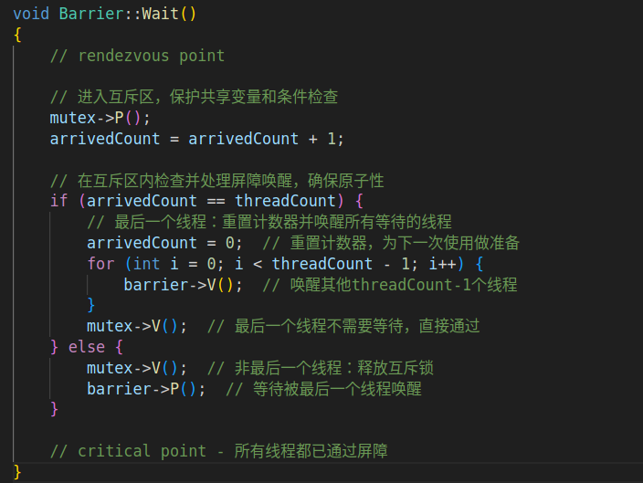

修复方案很简单：将条件检查和信号量操作都放在同一个mutex保护区内，确保原子性。具体实现是最后一个到达的线程在mutex保护内重置计数器并精确唤醒其他threadCount-1个线程，然后直接通过屏障；其他线程则在mutex保护外等待被唤醒。这样消除了竞争窗口，确保只有真正最后一个线程才能执行唤醒操作。

验证修复效果的测试步骤是重新编译程序后使用相同的随机种子进行对比测试，观察所有线程是否都能正确等待屏障同步。修复后的实现应该能够消除竞争条件，保证只有当所有线程都到达后屏障才会释放，同时通过计数器重置机制支持屏障的重复使用。


## 5.新屏障測試於分析

測試一：

```
./nachos -rs 1
```

運行結果一：

```
Starting N-thread barrier test with 10 threads
Each thread will do some work, then wait at the barrier
Only when all threads reach the barrier will they continue

Main thread: Starting work
Thread 0: Starting work
Thread 1: Starting work
Thread 2: Starting work
Thread 3: Starting work
Thread 4: Starting work
Thread 5: Starting work
Thread 6: Starting work
Thread 8: Starting work
Thread 9: Starting work
Thread 7: Starting work
Main thread: Reached rendezvous point
Thread 0: Reached rendezvous point
Thread 1: Reached rendezvous point
Thread 2: Reached rendezvous point
Thread 3: Reached rendezvous point
Thread 5: Reached rendezvous point
Thread 6: Reached rendezvous point
Thread 4: Reached rendezvous point
Thread 8: Reached rendezvous point
Thread 7: Reached rendezvous point
Main thread: Passed barrier, continuing work
Main thread: Finished

Barrier test completed
Thread 1: Passed barrier, continuing work
Thread 1: Finished
Thread 2: Passed barrier, continuing work
Thread 2: Finished
Thread 7: Passed barrier, continuing work
Thread 7: Finished
Thread 0: Passed barrier, continuing work
Thread 0: Finished
Thread 3: Passed barrier, continuing work
Thread 3: Finished
Thread 5: Passed barrier, continuing work
Thread 5: Finished
Thread 6: Passed barrier, continuing work
Thread 6: Finished
Thread 4: Passed barrier, continuing work
Thread 4: Finished
Thread 8: Passed barrier, continuing work
Thread 8: Finished
Thread 9: Reached rendezvous point
No threads ready or runnable, and no pending interrupts.
Assuming the program completed.
Machine halting!

Ticks: total 2447, idle 117, system 2330, user 0
Disk I/O: reads 0, writes 0
Console I/O: reads 0, writes 0
Paging: faults 0
Network I/O: packets received 0, sent 0

Cleaning up...

```

測試二：

```
./nachos -rs 2
```

測試結果二：

```
Starting N-thread barrier test with 10 threads
Each thread will do some work, then wait at the barrier
Only when all threads reach the barrier will they continue

Thread 0: Starting work
Thread 1: Starting work
Thread 2: Starting work
Thread 3: Starting work
Thread 4: Starting work
Thread 5: Starting work
Thread 6: Starting work
Thread 7: Starting work
Thread 8: Starting work
Main thread: Starting work
Thread 9: Starting work
Main thread: Reached rendezvous point
Thread 1: Reached rendezvous point
Thread 0: Reached rendezvous point
Thread 2: Reached rendezvous point
Thread 3: Reached rendezvous point
Thread 5: Reached rendezvous point
Thread 4: Reached rendezvous point
Thread 6: Reached rendezvous point
Thread 7: Reached rendezvous point
Thread 9: Reached rendezvous point
Main thread: Passed barrier, continuing work
Main thread: Finished

Barrier test completed
Thread 1: Passed barrier, continuing work
Thread 1: Finished
Thread 0: Passed barrier, continuing work
Thread 0: Finished
Thread 2: Passed barrier, continuing work
Thread 2: Finished
Thread 3: Passed barrier, continuing work
Thread 3: Finished
Thread 5: Passed barrier, continuing work
Thread 5: Finished
Thread 4: Passed barrier, continuing work
Thread 4: Finished
Thread 6: Passed barrier, continuing work
Thread 6: Finished
Thread 9: Passed barrier, continuing work
Thread 9: Finished
Thread 8: Reached rendezvous point
Thread 7: Passed barrier, continuing work
Thread 7: Finished
No threads ready or runnable, and no pending interrupts.
Assuming the program completed.
Machine halting!

Ticks: total 2493, idle 143, system 2350, user 0
Disk I/O: reads 0, writes 0
Console I/O: reads 0, writes 0
Paging: faults 0
Network I/O: packets received 0, sent 0

Cleaning up...

```

測試三：

```
./nachos -rs 3
```

測試結果三：

```
Starting N-thread barrier test with 10 threads
Each thread will do some work, then wait at the barrier
Only when all threads reach the barrier will they continue

Main thread: Starting work
Thread 0: Starting work
Thread 1: Starting work
Thread 2: Starting work
Thread 4: Starting work
Thread 5: Starting work
Thread 6: Starting work
Thread 7: Starting work
Thread 8: Starting work
Thread 9: Starting work
Thread 3: Starting work
Main thread: Reached rendezvous point
Thread 1: Reached rendezvous point
Thread 0: Reached rendezvous point
Thread 2: Reached rendezvous point
Thread 5: Reached rendezvous point
Thread 3: Reached rendezvous point
Thread 4: Reached rendezvous point
Thread 6: Reached rendezvous point
Thread 8: Reached rendezvous point
Thread 7: Reached rendezvous point
Main thread: Passed barrier, continuing work
Main thread: Finished

Barrier test completed
Thread 1: Passed barrier, continuing work
Thread 1: Finished
Thread 0: Passed barrier, continuing work
Thread 0: Finished
Thread 2: Passed barrier, continuing work
Thread 2: Finished
Thread 7: Passed barrier, continuing work
Thread 7: Finished
Thread 9: Reached rendezvous point
Thread 5: Passed barrier, continuing work
Thread 5: Finished
Thread 3: Passed barrier, continuing work
Thread 3: Finished
Thread 4: Passed barrier, continuing work
Thread 4: Finished
Thread 8: Passed barrier, continuing work
Thread 8: Finished
Thread 6: Passed barrier, continuing work
Thread 6: Finished
No threads ready or runnable, and no pending interrupts.
Assuming the program completed.
Machine halting!

Ticks: total 2399, idle 29, system 2370, user 0
Disk I/O: reads 0, writes 0
Console I/O: reads 0, writes 0
Paging: faults 0
Network I/O: packets received 0, sent 0

Cleaning up...

```

从修复后的三次测试结果可以看到，各线程打印输出的rendezvous行的顺序确实基本遵循线程被创建的顺序（0,1,2...9），即使使用了不同的随机数种子。这种现象表明-rs选项虽然起作用，但其影响程度有限。

这种现象的根本原因在于Nachos的非抢占式调度特性。在测试程序中，线程创建是连续进行的，每个线程通过Fork()被放入就绪队列后，由于没有其他抢占机制，它们基本上按照FIFO顺序获得CPU时间。虽然每个线程的工作循环长度略有不同，但这种差异相对较小，不足以打破创建顺序带来的调度优势。同时，-rs选项主要在系统调用中插入随机Yield，但我们的测试线程在到达rendezvous点之前只进行了很少的系统调用，因此随机性的影响被大大削弱。

为了增加线程到达rendezvous点的随机性，可以考虑增加软件空循环延迟或使用Linux的sleep函数，但这两种方法在Nachos环境中都存在局限性。软件空循环虽然可以增加执行时间的差异，但由于Nachos的调度机制，这种增加可能不会改变线程的基本调度顺序，只是延长了总体执行时间。而Linux的sleep函数在Nachos的模拟环境中不可用，即使可以使用，也会破坏Nachos的调度模拟，因为sleep会让出整个进程而不是线程。

真正有效的解决方案是在Nachos框架内增加随机性：增加Yield调用频率，引入更大的随机工作负载，或在即将到达rendezvous点之前强制调用Yield()。这些方法利用了Nachos自身的调度机制，在不破坏系统模拟的前提下增加了线程调度的随机性，能够更有效地测试并发程序在各种调度顺序下的正确性。

## 6.修改代码解决上面5出现的现象

为了解决线程到达rendezvous点顺序过于确定的问题，对测试代码进行了修改，主要通过增加随机性和提高Yield调用频率来打破原有的调度顺序。

具体修改包括将原来的固定工作循环`int work = 1000 + (which * 100)`改为随机工作循环`int work = 1000 + (Random() % 5000)`，大幅增加了线程执行时间的差异范围。同时将Yield调用频率从每100次循环改为每50次循环，增加了线程切换的机会。

更重要的是，我们在每个线程到达rendezvous点之前添加了随机延迟机制，通过一个0-2000范围的随机循环，并且在延迟期间每30次循环就调用一次Yield()。这种设计确保了即使线程按照创建顺序开始执行，在到达关键点之前也会经历不同的调度路径，从而打破了原有的确定性顺序。主线程也采用了相同的随机化策略，保证所有线程都有相同的随机性。

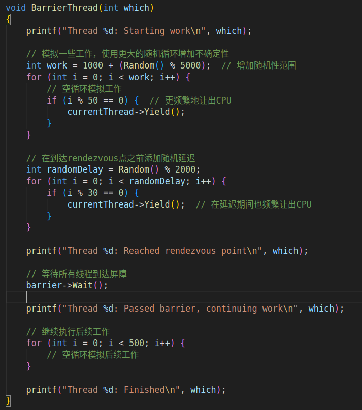

測試一：

```
./nachos -rs 2
```

運行結果一：

```
Starting N-thread barrier test with 10 threads
Each thread will do some work, then wait at the barrier
Only when all threads reach the barrier will they continue

Thread 0: Starting work
Thread 1: Starting work
Thread 2: Starting work
Thread 3: Starting work
Thread 4: Starting work
Thread 5: Starting work
Thread 6: Starting work
Thread 7: Starting work
Thread 8: Starting work
Main thread: Starting work
Thread 9: Starting work
Main thread: Reached rendezvous point
Thread 0: Reached rendezvous point
Thread 3: Reached rendezvous point
Thread 4: Reached rendezvous point
Thread 9: Reached rendezvous point
Thread 1: Reached rendezvous point
Thread 2: Reached rendezvous point
Thread 6: Reached rendezvous point
Thread 5: Reached rendezvous point
Thread 8: Reached rendezvous point
Thread 7: Reached rendezvous point
Main thread: Passed barrier, continuing work
Main thread: Finished

Barrier test completed
Thread 0: Passed barrier, continuing work
Thread 0: Finished
Thread 3: Passed barrier, continuing work
Thread 3: Finished
Thread 4: Passed barrier, continuing work
Thread 4: Finished
Thread 9: Passed barrier, continuing work
Thread 9: Finished
Thread 1: Passed barrier, continuing work
Thread 1: Finished
Thread 2: Passed barrier, continuing work
Thread 2: Finished
Thread 6: Passed barrier, continuing work
Thread 6: Finished
Thread 5: Passed barrier, continuing work
Thread 5: Finished
Thread 7: Passed barrier, continuing work
Thread 7: Finished
Thread 8: Passed barrier, continuing work
Thread 8: Finished
No threads ready or runnable, and no pending interrupts.
Assuming the program completed.
Machine halting!

Ticks: total 28416, idle 6, system 28410, user 0
Disk I/O: reads 0, writes 0
Console I/O: reads 0, writes 0
Paging: faults 0
Network I/O: packets received 0, sent 0

Cleaning up...

```

验证修改效果的测试过程是重新编译程序后使用不同的随机种子进行测试，观察线程到达rendezvous点的顺序是否变得更加随机和不可预测。通过这种在Nachos框架内增加随机性的方法，我们能够在不修改核心实现代码的前提下，有效地解决线程调度顺序过于确定的问题，为屏障同步机制提供更全面的测试环境。这种方法充分利用了Nachos自身的调度特性，通过增加线程执行时间的差异和调度频率，实现了真正有效的随机化测试。

