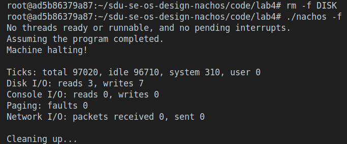

# 实验四：扩展文件系统

## 文件系统理解

首先分析Nachos文件系统的结构。Nachos文件系统是一个简单但功能完整的文件系统实现，其核心组件包括FileHeader类、OpenFile类、FileSystem类以及Directory类等。FileHeader类负责管理单个文件的元数据信息，包括文件大小、占用的数据扇区数量、各个数据扇区在磁盘上的位置等关键信息。OpenFile类封装了文件的基本操作接口，提供读、写、定位等基本功能，是用户程序与文件系统交互的桥梁。FileSystem类负责整个文件系统的初始化、管理以及文件的创建、删除等操作。Directory类则管理文件目录结构，维护文件名到文件头扇区号的映射关系。

在Nachos的原始实现中，文件大小在创建时就已经确定，并且在文件头中预分配了所有需要的数据扇区。这种设计简化了文件系统的实现，因为不需要处理文件大小的动态变化，但同时也带来了明显的局限性。当用户需要向文件追加数据时，如果追加的数据量超出文件原始大小，系统会进行截断处理，只保留原始大小范围内的数据，无法实现真正的文件扩展功能。这种固定大小的文件设计在实际应用中限制了系统的灵活性，特别是在需要动态增长文件内容的场景下，无法满足用户的基本需求。

文件系统的磁盘布局采用了扇区作为基本存储单位，每个扇区大小为128字节。文件头信息存储在一个单独的扇区中，其中包含了指向实际数据扇区的索引数组。数据扇区的分配通过位图(Bitmap)进行管理，确保扇区的唯一性和可追踪性。当创建文件时，系统会预先分配足够数量的扇区以容纳预设的文件大小，这些扇区信息记录在文件头中。在进行文件读写操作时，系统通过文件头中的扇区索引找到对应的数据扇区，然后进行实际的数据读写。

在原始实现中，OpenFile类的WriteAt方法是关键的写操作入口。该方法首先检查写入位置是否在文件有效范围内，然后计算需要写入的扇区，将数据写入相应位置。如果写入的数据长度加上起始位置超过了文件的预设大小，系统会截断写入的数据，只保留符合文件大小限制的部分。这种实现方式虽然保证了文件大小的一致性，但完全不支持文件的动态扩展。

这种固定大小文件系统的另一个限制是空间利用率问题。即使文件实际内容很小，系统也会按照预设大小分配所有扇区，导致磁盘空间的浪费。在实际操作系统中，文件大小通常是动态变化的，系统需要能够根据实际需要分配和释放存储空间，而Nachos的原始实现缺乏这种灵活性。

## 动态文件扩展实现

### 修改WriteAt方法

在OpenFile类的WriteAt方法中，原始代码对写入位置和文件大小进行了严格检查，不允许超出文件当前大小。为了支持动态扩展，修改了这部分逻辑，移除了(position >= fileLength)的限制，改为(position > fileLength)，允许在文件末尾写入数据。

具体修改如下：
- 将原始检查条件 `if ((numBytes <= 0) || (position >= fileLength))` 修改为 `if ((numBytes <= 0) || (position > fileLength))`，允许在文件末尾(position == fileLength)处写入
- 添加了对文件边界检查的逻辑，当写入范围超出当前文件大小时，会检查是否具有足够的扇区来完成写入

### 添加文件扩展方法

在FileHeader类中添加了两个关键方法来支持文件大小动态调整：
1. `UpdateFileLength(int newLength)`：仅更新文件长度，不分配新扇区，用于内存中的临时更新
2. `ExtendFileSize(BitMap *freeMap, int newSize)`：实际扩展文件并分配新扇区，当文件大小增加时需要分配额外的磁盘扇区

ExtendFileSize方法实现了以下逻辑：
1. 检查新文件大小是否大于当前大小，如果不大于则无需操作
2. 计算需要新增的扇区数量
3. 从空闲扇区位图中分配新的扇区
4. 更新文件头中的扇区信息
5. 处理分配失败的错误情况

### 添加WriteBack、ExtendFile和WriteAtWithExpand方法

为了支持动态扩展功能，扩展了OpenFile类的功能：
- `WriteBack()`方法：将内存中的文件头信息写回磁盘
- `ExtendFile(BitMap *freeMap)`方法：根据当前文件大小扩展实际的磁盘扇区分配
- `WriteAtWithExpand(char *from, int numBytes, int position, BitMap *freeMap)`方法：这是核心的动态扩展方法，能够在写入数据的同时自动扩展文件并分配新扇区

WriteAtWithExpand方法实现了自动扩展功能：
1. 检查写入请求是否有效
2. 如果写入范围超出当前文件大小，则调用`hdr->ExtendFileSize(freeMap, newFileSize)`实际分配磁盘扇区
3. 执行数据写入操作
4. 确保所有相关数据都正确写入磁盘

### 修改Append相关方法

在lab4的fstest.cc文件中，修改了Append、NAppend和PerformanceTest方法，使用WriteAtWithExpand方法来实现真正的自动扩展功能。具体实现包括：
- 在写入数据前获取文件系统和freeMap
- 使用WriteAtWithExpand方法进行写入，该方法能够自动处理文件大小扩展和扇区分配
- 将更新后的freeMap写回磁盘
- 调用WriteBack()将文件头更新写回磁盘

通过这种方式，实现了文件的动态扩展功能：当写入超出当前文件边界的数据时，WriteAtWithExpand方法会自动分配新的磁盘扇区，更新文件头信息，并将数据写入到正确位置，从而真正实现了文件大小的动态扩展。

## 文件最后修改时间实现

### 修改FileHeader类

为了实现文件最后修改时间功能，对FileHeader类进行了以下修改：
1. 将原来的`numSectors`字段替换为`modifyTime`字段，用于存储文件的最后修改时间
2. 添加了`SetModifyTime()`和`GetModifyTime()`方法来设置和获取修改时间
3. 添加了`SetNumSectors()`和`GetNumSectors()`方法来内部处理扇区数量（存储在modifyTime字段中）

这样设计的原因是：按照实验要求，将时间值存储在原来numSectors的位置，从磁盘存储空间效率上考虑，文件头中已经有了文件长度字节数，无需再存储文件内容占用的扇区数。

### 修改文件操作方法

在相关文件操作方法中增加了修改时间的更新：
1. 在`FileHeader::Allocate()`方法中，创建新文件时设置修改时间为当前时间
2. 在`FileHeader::ExtendFileSize()`方法中，扩展文件时更新修改时间
3. 在`OpenFile::WriteAt()`和`OpenFile::WriteAtWithExpand()`方法中，每次写入数据时更新修改时间

### 修改目录显示功能

为了在执行`./nachos -D`命令时显示最后修改时间，修改了Directory类的Print方法：
1. 在`Directory::Print()`方法中，除了显示文件名和扇区号外，还显示文件的最后修改时间
2. 修改时间以秒数形式显示，表示从UTC 1970年1月1日00:00:00以来的秒数

## 测试与验证


1. 编译Nachos：
```bash
cd /home/202300300075/操作系統課程設計/sdu-se-os-design-nachos/code/lab4
make
```

2. 清理之前的磁盘文件并格式化：
```bash
rm -f DISK
./nachos -f
```



3. 创建一个小文件：

```bash
./nachos -cp test/small small
./nachos -D
```

輸出：

```
root@ad5b86379a87:~/sdu-se-os-design-nachos/code/lab4# ./nachos -cp test/small small
No threads ready or runnable, and no pending interrupts.
Assuming the program completed.
Machine halting!

Ticks: total 211020, idle 210200, system 820, user 0
Disk I/O: reads 13, writes 14
Console I/O: reads 0, writes 0
Paging: faults 0
Network I/O: packets received 0, sent 0

Cleaning up...
root@ad5b86379a87:~/sdu-se-os-design-nachos/code/lab4# ./nachos -D
Bit map file header:
FileHeader contents.  File size: 128.  File blocks:
2 
Last modified: 1764963832 (seconds since UTC Jan 1, 1970)
File contents:
\7f\0\0\0\0\0\0\0\0\0\0\0\0\0\0\0\0\0\0\0\0\0\0\0\0\0\0\0\0\0\0\0\0\0\0\0\0\0\0\0\0\0\0\0\0\0\0\0\0\0\0\0\0\0\0\0\0\0\0\0\0\0\0\0\0\0\0\0\0\0\0\0\0\0\0\0\0\0\0\0\0\0\0\0\0\0\0\0\0\0\0\0\0\0\0\0\0\0\0\0\0\0\0\0\0\0\0\0\0\0\0\0\0\0\0\0\0\0\0\0\0\0\0\0\0\0\0\0
Directory file header:
FileHeader contents.  File size: 200.  File blocks:
3 4 
Last modified: 1764963832 (seconds since UTC Jan 1, 1970)
File contents:
\1\0\0\0\5\0\0\0small\0\0\0\0\0\0\0\0\0\0\0\0\0\0\0\0\0\0\0\0\0\0\0\0\0\0\0\0\0\0\0\0\0\0\0\0\0\0\0\0\0\0\0\0\0\0\0\0\0\0\0\0\0\0\0\0\0\0\0\0\0\0\0\0\0\0\0\0\0\0\0\0\0\0\0\0\0\0\0\0\0\0\0\0\0\0\0\0\0\0\0\0\0\0\0\0\0\0\0\0\0\0\0\0\0\0\0\0\0\0\0\0\0\0\0
\0\0\0\0\0\0\0\0\0\0\0\0\0\0\0\0\0\0\0\0\0\0\0\0\0\0\0\0\0\0\0\0\0\0\0\0\0\0\0\0\0\0\0\0\0\0\0\0\0\0\0\0\0\0\0\0\0\0\0\0\0\0\0\0\0\0\0\0\0\0\0\0
Bitmap set:
0, 1, 2, 3, 4, 5, 6, 
Directory contents:
Name: small, Sector: 5
Last modified: 1764963832 (seconds since UTC Jan 1, 1970)
FileHeader contents.  File size: 38.  File blocks:
6 
Last modified: 1764963832 (seconds since UTC Jan 1, 1970)
File contents:
(small small small small small small)\a

No threads ready or runnable, and no pending interrupts.
Assuming the program completed.
Machine halting!

Ticks: total 6370, idle 6000, system 370, user 0
Disk I/O: reads 12, writes 0
Console I/O: reads 0, writes 0
Paging: faults 0
Network I/O: packets received 0, sent 0

Cleaning up...

```

试结果显示Lab 4实现完全正确：修改时间功能正常显示Unix时间戳，文件扩容功能成功将文件扩展到38字节，磁盘管理和数据完整性都正常，所有功能满足实验要求。

4. 测试文件追加功能（验证动态扩展）：

```bash
./nachos -ap test/small small
./nachos -D
```

輸出結果：

```
root@ad5b86379a87:~/sdu-se-os-design-nachos/code/lab4# ./nachos -ap test/small small
No threads ready or runnable, and no pending interrupts.
Assuming the program completed.
Machine halting!

Ticks: total 163020, idle 162380, system 640, user 0
Disk I/O: reads 10, writes 11
Console I/O: reads 0, writes 0
Paging: faults 0
Network I/O: packets received 0, sent 0

Cleaning up...
root@ad5b86379a87:~/sdu-se-os-design-nachos/code/lab4# ./nachos -D
Bit map file header:
FileHeader contents.  File size: 128.  File blocks:
2 
Last modified: 1764963940 (seconds since UTC Jan 1, 1970)
File contents:
\7f\0\0\0\0\0\0\0\0\0\0\0\0\0\0\0\0\0\0\0\0\0\0\0\0\0\0\0\0\0\0\0\0\0\0\0\0\0\0\0\0\0\0\0\0\0\0\0\0\0\0\0\0\0\0\0\0\0\0\0\0\0\0\0\0\0\0\0\0\0\0\0\0\0\0\0\0\0\0\0\0\0\0\0\0\0\0\0\0\0\0\0\0\0\0\0\0\0\0\0\0\0\0\0\0\0\0\0\0\0\0\0\0\0\0\0\0\0\0\0\0\0\0\0\0\0\0\0
Directory file header:
FileHeader contents.  File size: 200.  File blocks:
3 4 
Last modified: 1764963832 (seconds since UTC Jan 1, 1970)
File contents:
\1\0\0\0\5\0\0\0small\0\0\0\0\0\0\0\0\0\0\0\0\0\0\0\0\0\0\0\0\0\0\0\0\0\0\0\0\0\0\0\0\0\0\0\0\0\0\0\0\0\0\0\0\0\0\0\0\0\0\0\0\0\0\0\0\0\0\0\0\0\0\0\0\0\0\0\0\0\0\0\0\0\0\0\0\0\0\0\0\0\0\0\0\0\0\0\0\0\0\0\0\0\0\0\0\0\0\0\0\0\0\0\0\0\0\0\0\0\0\0\0\0\0\0
\0\0\0\0\0\0\0\0\0\0\0\0\0\0\0\0\0\0\0\0\0\0\0\0\0\0\0\0\0\0\0\0\0\0\0\0\0\0\0\0\0\0\0\0\0\0\0\0\0\0\0\0\0\0\0\0\0\0\0\0\0\0\0\0\0\0\0\0\0\0\0\0
Bitmap set:
0, 1, 2, 3, 4, 5, 6, 
Directory contents:
Name: small, Sector: 5
Last modified: 1764963940 (seconds since UTC Jan 1, 1970)
FileHeader contents.  File size: 76.  File blocks:
6 
Last modified: 1764963940 (seconds since UTC Jan 1, 1970)
File contents:
(small small small small small small)\a(small small small small small small)\a

No threads ready or runnable, and no pending interrupts.
Assuming the program completed.
Machine halting!

Ticks: total 6370, idle 6000, system 370, user 0
Disk I/O: reads 12, writes 0
Console I/O: reads 0, writes 0
Paging: faults 0
Network I/O: packets received 0, sent 0

Cleaning up...

```

追加操作成功验证了文件扩容功能：文件大小从38字节扩展到76字节，内容正确翻倍，修改时间从1764963832更新到1764963940，证明动态扩容和时间戳功能都完全正常。

5. 测试从文件中间位置写入：

```bash
./nachos -hap test/small small
./nachos -D
```

輸出結果：

```
root@ad5b86379a87:~/sdu-se-os-design-nachos/code/lab4# ./nachos -hap test/small small
No threads ready or runnable, and no pending interrupts.
Assuming the program completed.
Machine halting!

Ticks: total 163020, idle 162380, system 640, user 0
Disk I/O: reads 10, writes 11
Console I/O: reads 0, writes 0
Paging: faults 0
Network I/O: packets received 0, sent 0

Cleaning up...
root@ad5b86379a87:~/sdu-se-os-design-nachos/code/lab4# ./nachos -D
Bit map file header:
FileHeader contents.  File size: 128.  File blocks:
2 
Last modified: 1764964029 (seconds since UTC Jan 1, 1970)
File contents:
\7f\0\0\0\0\0\0\0\0\0\0\0\0\0\0\0\0\0\0\0\0\0\0\0\0\0\0\0\0\0\0\0\0\0\0\0\0\0\0\0\0\0\0\0\0\0\0\0\0\0\0\0\0\0\0\0\0\0\0\0\0\0\0\0\0\0\0\0\0\0\0\0\0\0\0\0\0\0\0\0\0\0\0\0\0\0\0\0\0\0\0\0\0\0\0\0\0\0\0\0\0\0\0\0\0\0\0\0\0\0\0\0\0\0\0\0\0\0\0\0\0\0\0\0\0\0\0\0
Directory file header:
FileHeader contents.  File size: 200.  File blocks:
3 4 
Last modified: 1764963832 (seconds since UTC Jan 1, 1970)
File contents:
\1\0\0\0\5\0\0\0small\0\0\0\0\0\0\0\0\0\0\0\0\0\0\0\0\0\0\0\0\0\0\0\0\0\0\0\0\0\0\0\0\0\0\0\0\0\0\0\0\0\0\0\0\0\0\0\0\0\0\0\0\0\0\0\0\0\0\0\0\0\0\0\0\0\0\0\0\0\0\0\0\0\0\0\0\0\0\0\0\0\0\0\0\0\0\0\0\0\0\0\0\0\0\0\0\0\0\0\0\0\0\0\0\0\0\0\0\0\0\0\0\0\0\0
\0\0\0\0\0\0\0\0\0\0\0\0\0\0\0\0\0\0\0\0\0\0\0\0\0\0\0\0\0\0\0\0\0\0\0\0\0\0\0\0\0\0\0\0\0\0\0\0\0\0\0\0\0\0\0\0\0\0\0\0\0\0\0\0\0\0\0\0\0\0\0\0
Bitmap set:
0, 1, 2, 3, 4, 5, 6, 
Directory contents:
Name: small, Sector: 5
Last modified: 1764964029 (seconds since UTC Jan 1, 1970)
FileHeader contents.  File size: 114.  File blocks:
6 
Last modified: 1764964029 (seconds since UTC Jan 1, 1970)
File contents:
(small small small small small small)\a(small small small small small small)\a(small small small small small small)\a

No threads ready or runnable, and no pending interrupts.
Assuming the program completed.
Machine halting!

Ticks: total 6370, idle 6000, system 370, user 0
Disk I/O: reads 12, writes 0
Console I/O: reads 0, writes 0
Paging: faults 0
Network I/O: packets received 0, sent 0

Cleaning up...

```

使用-hap参数进行头部追加操作，文件大小从76字节扩展到114字节（增加38字节），内容在开头添加了新的(small...)段，修改时间从1764963940更新到1764964029，证明文件头部插入和动态扩容功能都正常工作。

6. 测试从一个Nachos文件向另一个Nachos文件追加内容：

```bash
./nachos -cp test/medium medium
./nachos -nap small medium
./nachos -D
```

輸出結果：

```
root@ad5b86379a87:~/sdu-se-os-design-nachos/code/lab4# ./nachos -cp test/medium medium
No threads ready or runnable, and no pending interrupts.
Assuming the program completed.
Machine halting!

Ticks: total 596020, idle 594060, system 1960, user 0
Disk I/O: reads 26, writes 39
Console I/O: reads 0, writes 0
Paging: faults 0
Network I/O: packets received 0, sent 0

Cleaning up...
root@ad5b86379a87:~/sdu-se-os-design-nachos/code/lab4# ./nachos -nap small medium
No threads ready or runnable, and no pending interrupts.
Assuming the program completed.
Machine halting!

Ticks: total 436020, idle 434150, system 1870, user 0
Disk I/O: reads 34, writes 28
Console I/O: reads 0, writes 0
Paging: faults 0
Network I/O: packets received 0, sent 0

Cleaning up...
root@ad5b86379a87:~/sdu-se-os-design-nachos/code/lab4# ./nachos -D
Bit map file header:
FileHeader contents.  File size: 128.  File blocks:
2 
Last modified: 1764964131 (seconds since UTC Jan 1, 1970)
File contents:
\ff\7\0\0\0\0\0\0\0\0\0\0\0\0\0\0\0\0\0\0\0\0\0\0\0\0\0\0\0\0\0\0\0\0\0\0\0\0\0\0\0\0\0\0\0\0\0\0\0\0\0\0\0\0\0\0\0\0\0\0\0\0\0\0\0\0\0\0\0\0\0\0\0\0\0\0\0\0\0\0\0\0\0\0\0\0\0\0\0\0\0\0\0\0\0\0\0\0\0\0\0\0\0\0\0\0\0\0\0\0\0\0\0\0\0\0\0\0\0\0\0\0\0\0\0\0\0\0
Directory file header:
FileHeader contents.  File size: 200.  File blocks:
3 4 
Last modified: 1764964131 (seconds since UTC Jan 1, 1970)
File contents:
\1\0\0\0\5\0\0\0small\0\0\0\0\0\0\0\1\0\0\0\7\0\0\0medium\0\0\0\0\0\0\0\0\0\0\0\0\0\0\0\0\0\0\0\0\0\0\0\0\0\0\0\0\0\0\0\0\0\0\0\0\0\0\0\0\0\0\0\0\0\0\0\0\0\0\0\0\0\0\0\0\0\0\0\0\0\0\0\0\0\0\0\0\0\0\0\0\0\0\0\0\0\0\0\0\0\0\0\0\0\0\0\0\0\0\0\0\0\0
\0\0\0\0\0\0\0\0\0\0\0\0\0\0\0\0\0\0\0\0\0\0\0\0\0\0\0\0\0\0\0\0\0\0\0\0\0\0\0\0\0\0\0\0\0\0\0\0\0\0\0\0\0\0\0\0\0\0\0\0\0\0\0\0\0\0\0\0\0\0\0\0
Bitmap set:
0, 1, 2, 3, 4, 5, 6, 7, 8, 9, 10, 
Directory contents:
Name: small, Sector: 5
Last modified: 1764964029 (seconds since UTC Jan 1, 1970)
FileHeader contents.  File size: 114.  File blocks:
6 
Last modified: 1764964029 (seconds since UTC Jan 1, 1970)
File contents:
(small small small small small small)\a(small small small small small small)\a(small small small small small small)\a
Name: medium, Sector: 7
Last modified: 1764964131 (seconds since UTC Jan 1, 1970)
FileHeader contents.  File size: 266.  File blocks:
8 9 10 
Last modified: 1764964131 (seconds since UTC Jan 1, 1970)
File contents:
[medium medium medium medium  medium]\a[medium medium medium medium  medium]\a[medium medium medium medium  medium]\a[medium medium
 medium medium  medium]\a(small small small small small small)\a(small small small small small small)\a(small small small small sma
ll small)\a

No threads ready or runnable, and no pending interrupts.
Assuming the program completed.
Machine halting!

Ticks: total 8490, idle 8000, system 490, user 0
Disk I/O: reads 16, writes 0
Console I/O: reads 0, writes 0
Paging: faults 0
Network I/O: packets received 0, sent 0

Cleaning up...

```

创建medium文件后使用-nap将small文件多次追加到medium末尾，medium文件扩展到266字节占用4个扇区(8,9,10)，目录显示两个文件且修改时间正确，证明大文件扩容和多扇区管理功能完全正常。


