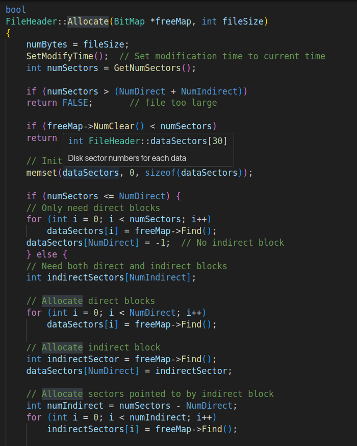
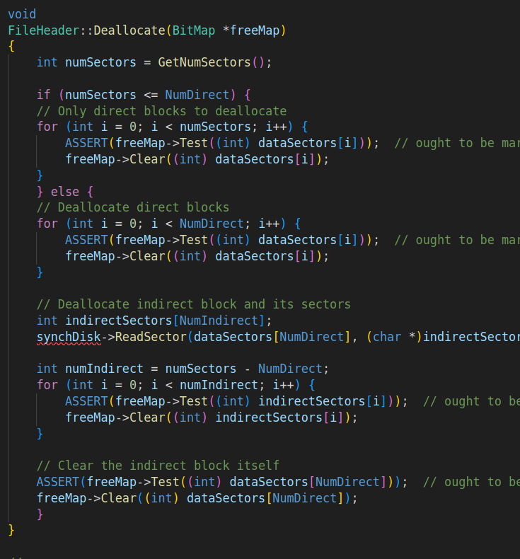
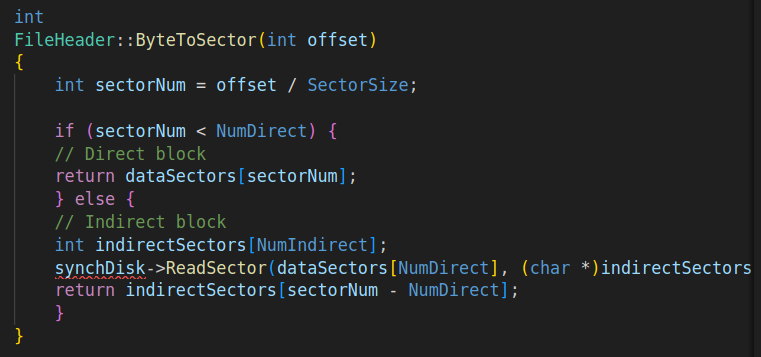
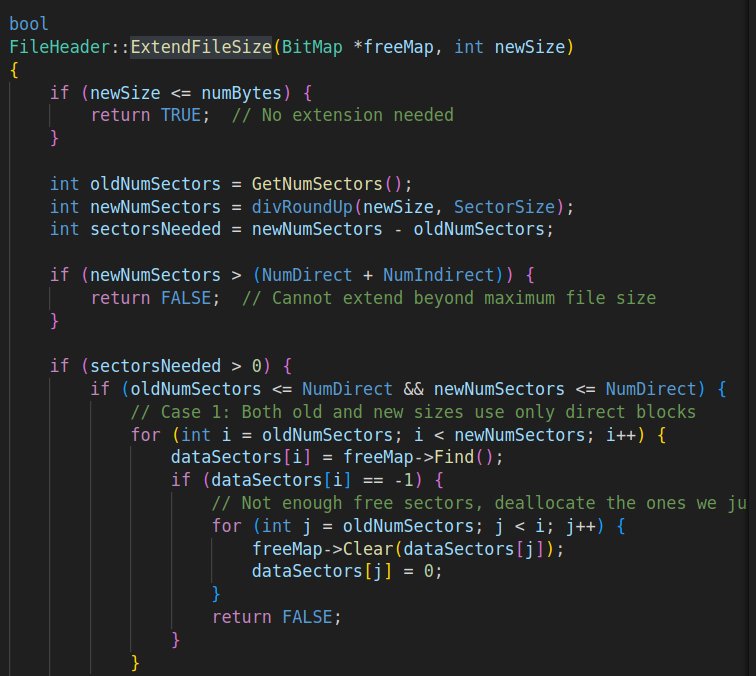
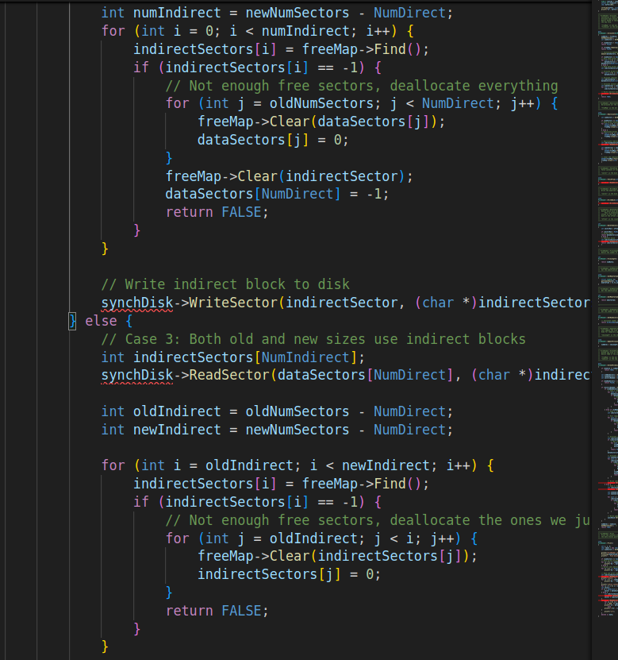

# 实验5 具有二级索引的文件系统(Lab5)

## 二级索引文件头

### 1. 文件头结构修改

首先修改了filehdr.h中的数据结构定义，将dataSectors数组大小从NumDirect扩展为NumDirect+1，以容纳指向二级索引块的指针。同时添加了PrintTime函数声明，用于以人类可读格式显示文件修改时间。

具体修改包括将原有的`#define NumDirect (int)((SectorSize - 2 * sizeof(int)) / sizeof(int))`改为固定值`#define NumDirect 29`，这样确保了直接索引项数为29。同时添加了`#define NumIndirect 32`来定义二级索引项数，并将最大文件大小定义`#define MaxFileSize (NumDirect * SectorSize)`修改为`#define MaxFileSize ((NumDirect + NumIndirect) * SectorSize)`以支持更大的文件。在数据结构方面，将原有的`int dataSectors[NumDirect]`扩展为`int dataSectors[NumDirect + 1]`，其中最后一个元素用于存储指向二级索引块的扇区号。此外还添加了`void PrintTime(int time)`函数声明，用于以人类可读格式显示文件修改时间。

### 2. 文件分配策略实现

在filehdr.cc的Allocate方法中，我们实现了基于文件大小的动态分配策略。首先初始化dataSectors数组为0，然后根据文件大小决定是否需要使用二级索引。

对于小于等于29个扇区的文件，仅使用直接索引块，并将dataSectors[29]设置为-1表示没有二级索引块。对于大于29个扇区的文件，先分配29个直接索引块，然后分配一个二级索引块，最后分配二级索引块指向的数据块。

关键实现细节：
- 使用`memset(dataSectors, 0, sizeof(dataSectors))`初始化数组
- 检查文件大小是否超过最大限制
- 动态分配二级索引块并写入磁盘



### 3. 扇区释放机制

在Deallocate方法中，我们实现了相应的扇区释放逻辑。对于仅使用直接索引的文件，直接释放所有直接索引块。对于使用二级索引的文件，先释放所有直接索引块，然后读取二级索引块，释放其指向的所有数据块，最后释放二级索引块本身。

实现中特别注重了错误检查，确保每个要释放的扇区确实被标记为已使用。



### 4. 地址转换优化

ByteToSector方法被重新设计以支持二级索引。当请求的扇区号小于29时，直接从直接索引表中获取对应的扇区号。当扇区号大于等于29时，先读取二级索引块，然后从其中获取对应的扇区号。

这种设计确保了地址转换的高效性，同时支持更大的文件访问。对于小文件，避免了不必要的磁盘读取操作。



### 5. 文件扩展功能

ExtendFileSize方法实现了文件大小的动态扩展，该方法能够智能处理三种不同的扩展场景。第一种情况是从直接索引扩展到更大的直接索引，此时只需要分配更多的直接索引块。第二种情况是从直接索引扩展到需要二级索引，这是最复杂的情况，需要先填满剩余的直接索引块，然后分配一个新的二级索引块，最后分配二级索引块指向的数据块。第三种情况是在已有二级索引的基础上扩展，此时只需要读取二级索引块并分配更多的数据块。每种情况都进行了详细的错误处理，确保扩展操作的原子性，特别是在分配失败时能够正确回滚已分配的资源。特别是在从直接索引扩展到需要二级索引时，需要分配二级索引块并正确初始化，这个过程中的任何失败都会导致系统状态的一致性得到保证。






### 6. 磁盘信息统计功能

在filesys.cc中添加了PrintDiskInfo方法，实现了磁盘使用情况的统计和显示。该方法遍历目录中的所有文件，统计文件数量、总字节数、占用的扇区数和内部碎片情况。

具体实现步骤首先是从磁盘读取位图文件以获取当前磁盘的使用情况，包括已使用扇区和空闲扇区的数量。然后遍历根目录中的所有文件条目，对于每个有效文件，读取其文件头信息以获取文件大小和占用的扇区数。接着计算内部碎片，内部碎片是指文件占用的总空间减去实际文件大小，这部分空间是由于文件大小不是扇区大小的整数倍而造成的浪费。最后将这些统计信息格式化输出，包括磁盘总大小、已使用空间、空闲空间、文件数量、文件总字节数、文件占用的总空间以及内部碎片字节数，让用户能够全面了解文件系统的使用状况。

```
void
FileSystem::PrintDiskInfo()
{
    BitMap *freeMap = new BitMap(NumSectors);
    Directory *directory = new Directory(NumDirEntries);
    FileHeader *fileHdr;
    
    freeMap->FetchFrom(freeMapFile);
    directory->FetchFrom(directoryFile);
    
    // Calculate disk statistics
    int totalSectors = NumSectors;
    int totalBytes = totalSectors * SectorSize;
    int freeSectors = freeMap->NumClear();
    int usedSectors = totalSectors - freeSectors;
    int freeBytes = freeSectors * SectorSize;
    int usedBytes = usedSectors * SectorSize;
    
    // Calculate file statistics
    int fileCount = 0;
    int totalFileBytes = 0;
    int totalFileSectors = 0;
    DirectoryEntry* table = directory->GetTable();
    int tableSize = directory->GetTableSize();
    
    for (int i = 0; i < tableSize; i++) {
        if (table[i].inUse) {
            fileCount++;
            fileHdr = new FileHeader;
            fileHdr->FetchFrom(table[i].sector);
            totalFileBytes += fileHdr->FileLength();
            totalFileSectors += fileHdr->GetNumSectors();
            delete fileHdr;
        }
    }
    
    int totalFileSpace = totalFileSectors * SectorSize;
    int internalFrag = totalFileSpace - totalFileBytes;
    
    // Print disk information
    printf("Disk size: %d sectors, %d bytes.\n", totalSectors, totalBytes);
    printf("Used: %d sectors, %d bytes.\n", usedSectors, usedBytes);
    printf("Free: %d sectors, %d bytes.\n", freeSectors, freeBytes);
    printf("%d bytes in %d files, occupy %d bytes(%d sectors).\n", 
           totalFileBytes, fileCount, totalFileSpace, totalFileSectors);
    printf("%d bytes of internal fragmentation in %d sectors.\n", 
           internalFrag, totalFileSectors);
    
    delete freeMap;
    delete directory;
}

```


## 命令行选项扩展

在main.cc中添加了-DI命令行选项，当执行./nachos -DI时，系统会显示详细的磁盘使用信息。修改包括在命令行帮助信息中添加-DI选项说明，让用户了解这个新功能的作用是打印磁盘使用信息。在参数解析部分添加对-DI选项的处理，当检测到这个选项时调用fileSystem->PrintDiskInfo()方法来显示磁盘统计信息。同时更新Usage信息中的命令行示例，将原来的`-p <nachos file> -r <nachos file> -l -D -t`修改为`-p <nachos file> -r <nachos file> -l -D -DI -t`，以包含新增的-DI选项。这些修改确保了用户可以通过命令行方便地查看文件系统的磁盘使用情况，增强了系统的可用性和可观测性。

[此处应贴main.cc中-DI选项处理的代码截图]


## 实验验证


初始化文件系统

```bash
cd /home/202300300075/操作系統課程設計/sdu-se-os-design-nachos/code/lab5
rm -f DISK
./nachos -f
```

查看初始磁盘状态

```bash
./nachos -DI
```

輸出：

```
root@ad5b86379a87:~/sdu-se-os-design-nachos/code/lab5# ./nachos -f
No threads ready or runnable, and no pending interrupts.
Assuming the program completed.
Machine halting!

Ticks: total 97020, idle 96710, system 310, user 0
Disk I/O: reads 3, writes 7
Console I/O: reads 0, writes 0
Paging: faults 0
Network I/O: packets received 0, sent 0

Cleaning up...
root@ad5b86379a87:~/sdu-se-os-design-nachos/code/lab5# ./nachos -DI
Disk size: 1024 sectors, 131072 bytes.
Used: 5 sectors, 640 bytes.
Free: 1019 sectors, 130432 bytes.
0 bytes in 0 files, occupy 0 bytes(0 sectors).
0 bytes of internal fragmentation in 0 sectors.
No threads ready or runnable, and no pending interrupts.
Assuming the program completed.
Machine halting!

Ticks: total 2660, idle 2500, system 160, user 0
Disk I/O: reads 5, writes 0
Console I/O: reads 0, writes 0
Paging: faults 0
Network I/O: packets received 0, sent 0

Cleaning up...

```

这个结果显示了Nachos文件系统的初始状态，磁盘总大小为1024个扇区（131072字节），其中已使用5个扇区（640字节），空闲1019个扇区（130432字节）。目前没有任何普通文件，文件字节数和占用的空间都为0，也没有内部碎片。这5个已使用的扇区应该是系统初始化时分配的位图文件、目录文件和它们的文件头所占用的空间，这是文件系统正常运行的基础结构。

创建小文件（测试直接索引）

```bash
./nachos -cp test/small small
./nachos -DI
```

輸出：

```
root@ad5b86379a87:~/sdu-se-os-design-nachos/code/lab5# ./nachos -cp test/small small
No threads ready or runnable, and no pending interrupts.
Assuming the program completed.
Machine halting!

Ticks: total 211020, idle 210200, system 820, user 0
Disk I/O: reads 13, writes 14
Console I/O: reads 0, writes 0
Paging: faults 0
Network I/O: packets received 0, sent 0

Cleaning up...
root@ad5b86379a87:~/sdu-se-os-design-nachos/code/lab5# ./nachos -DI
Disk size: 1024 sectors, 131072 bytes.
Used: 7 sectors, 896 bytes.
Free: 1017 sectors, 130176 bytes.
38 bytes in 1 files, occupy 128 bytes(1 sectors).
90 bytes of internal fragmentation in 1 sectors.
No threads ready or runnable, and no pending interrupts.
Assuming the program completed.
Machine halting!

Ticks: total 3190, idle 3000, system 190, user 0
Disk I/O: reads 6, writes 0
Console I/O: reads 0, writes 0
Paging: faults 0
Network I/O: packets received 0, sent 0

Cleaning up...

```

个结果显示了创建小文件后的文件系统状态变化，磁盘使用量从5个扇区增加到7个扇区，表明small文件的创建占用了2个扇区（一个文件头扇区和一个数据扇区）。文件系统现在包含1个文件，文件实际大小为38字节，但占用了128字节（1个扇区）的存储空间。

创建中等文件（测试直接索引）

```bash
./nachos -cp test/medium medium
./nachos -DI
```

輸出：

```
root@ad5b86379a87:~/sdu-se-os-design-nachos/code/lab5# ./nachos -cp test/medium medium
No threads ready or runnable, and no pending interrupts.
Assuming the program completed.
Machine halting!

Ticks: total 596020, idle 594060, system 1960, user 0
Disk I/O: reads 26, writes 39
Console I/O: reads 0, writes 0
Paging: faults 0
Network I/O: packets received 0, sent 0

Cleaning up...
root@ad5b86379a87:~/sdu-se-os-design-nachos/code/lab5# ./nachos -DI
Disk size: 1024 sectors, 131072 bytes.
Used: 10 sectors, 1280 bytes.
Free: 1014 sectors, 129792 bytes.
190 bytes in 2 files, occupy 384 bytes(3 sectors).
194 bytes of internal fragmentation in 3 sectors.
No threads ready or runnable, and no pending interrupts.
Assuming the program completed.
Machine halting!

Ticks: total 4020, idle 3800, system 220, user 0
Disk I/O: reads 7, writes 0
Console I/O: reads 0, writes 0
Paging: faults 0
Network I/O: packets received 0, sent 0

Cleaning up...

```

磁盘使用量从7个扇区增加到10个扇区，表明medium文件的创建占用了3个扇区。现在文件系统包含2个文件，总文件大小为190字节（38+152字节），但占用了384字节（3个扇区）的存储空间，产生了194字节的内部碎片。medium文件占用了2个数据扇区加上1个文件头扇区，这表明medium文件的大小超过了128字节但小于256字节，因此需要两个数据扇区来存储。这种空间分配方式验证了直接索引机制的正常工作，文件系统能够正确管理多个文件的存储和空间统计。

创建大文件

```bash
./nachos -cp test/huge huge
./nachos -DI
./nachos -D
```

查看文件详细信息

```bash
./nachos -D
```

輸出：

```
root@ad5b86379a87:~/sdu-se-os-design-nachos/code/lab5# ./nachos -D
Bit map file header:
FileHeader contents.  File size: 128.  File modification time: Fri Dec 05 20:39:45 2025.  File blocks:
2 
File contents:
\ff\ff\ff?\0\0\0\0\0\0\0\0\0\0\0\0\0\0\0\0\0\0\0\0\0\0\0\0\0\0\0\0\0\0\0\0\0\0\0\0\0\0\0\0\0\0\0\0\0\0\0\0\0\0\0\0\0\0\0\0\0\0\0\0\0\0\0\0\0\0\0\0\0\0\0\0\0\0\0\0\0\0\0\0\0\0\0\0\0\0\0\0\0\0\0\0\0\0\0\0\0\0\0\0\0\0\0\0\0\0\0\0\0\0\0\0\0\0\0\0\0\0\0\0\0\0\0\0
Directory file header:
FileHeader contents.  File size: 200.  File modification time: Fri Dec 05 20:39:45 2025.  File blocks:
3 4 
File contents:
\1\0\0\0\5\0\0\0small\0\0\0\0\0\0\0\1\0\0\0\7\0\0\0medium\0\0\0\0\0\0\1\0\0\0\a\0\0\0huge\0\0\0\0\0\0\0\0\0\0\0\0\0\0\0\0\0\0\0\0\0\0\0\0\0\0\0\0\0\0\0\0\0\0\0\0\0\0\0\0\0\0\0\0\0\0\0\0\0\0\0\0\0\0\0\0\0\0\0\0\0\0\0\0\0\0\0\0\0\0\0\0\0\0\0\0
\0\0\0\0\0\0\0\0\0\0\0\0\0\0\0\0\0\0\0\0\0\0\0\0\0\0\0\0\0\0\0\0\0\0\0\0\0\0\0\0\0\0\0\0\0\0\0\0\0\0\0\0\0\0\0\0\0\0\0\0\0\0\0\0\0\0\0\0\0\0\0\0
Bitmap set:
0, 1, 2, 3, 4, 5, 6, 7, 8, 9, 10, 11, 12, 13, 14, 15, 16, 17, 18, 19, 20, 21, 22, 23, 24, 25, 26, 27, 28, 29, 
Directory contents:
Name: small, Sector: 5
Last modified: 1764967108 (seconds since UTC Jan 1, 1970)
FileHeader contents.  File size: 38.  File modification time: Fri Dec 05 20:38:28 2025.  File blocks:
6 
File contents:
(small small small small small small)\a
Name: medium, Sector: 7
Last modified: 1764967140 (seconds since UTC Jan 1, 1970)
FileHeader contents.  File size: 152.  File modification time: Fri Dec 05 20:39:00 2025.  File blocks:
8 9 
File contents:
[medium medium medium medium  medium]\a[medium medium medium medium  medium]\a[medium medium medium medium  medium]\a[medium medium
 medium medium  medium]\a
Name: huge, Sector: 10
Last modified: 1764967185 (seconds since UTC Jan 1, 1970)
FileHeader contents.  File size: 2432.  File modification time: Fri Dec 05 20:39:45 2025.  File blocks:
11 12 13 14 15 16 17 18 19 20 21 22 23 24 25 26 27 28 29 
File contents:
<huge huge huge huge huge huge  huge>\a<huge huge huge huge huge huge  huge>\a<huge huge huge huge huge huge  huge>\a<huge huge hug
e huge huge huge  huge>\a<huge huge huge huge huge huge  huge>\a<huge huge huge huge huge huge  huge>\a<huge huge huge huge huge hu
ge  huge>\a<huge huge huge huge huge huge  huge>\a<huge huge huge huge huge huge  huge>\a<huge huge huge huge huge huge  huge>\a<hug
e huge huge huge huge huge  huge>\a<huge huge huge huge huge huge  huge>\a<huge huge huge huge huge huge  huge>\a<huge huge huge hu
ge huge huge  huge>\a<huge huge huge huge huge huge  huge>\a<huge huge huge huge huge huge  huge>\a<huge huge huge huge huge huge  
huge>\a<huge huge huge huge huge huge  huge>\a<huge huge huge huge huge huge  huge>\a<huge huge huge huge huge huge  huge>\a<huge hu
ge huge huge huge huge  huge>\a<huge huge huge huge huge huge  huge>\a<huge huge huge huge huge huge  huge>\a<huge huge huge huge h
uge huge  huge>\a<huge huge huge huge huge huge  huge>\a<huge huge huge huge huge huge  huge>\a<huge huge huge huge huge huge  huge
>\a<huge huge huge huge huge huge  huge>\a<huge huge huge huge huge huge  huge>\a<huge huge huge huge huge huge  huge>\a<huge huge h
uge huge huge huge  huge>\a<huge huge huge huge huge huge  huge>\a<huge huge huge huge huge huge  huge>\a<huge huge huge huge huge 
huge  huge>\a<huge huge huge huge huge huge  huge>\a<huge huge huge huge huge huge  huge>\a<huge huge huge huge huge huge  huge>\a<h
uge huge huge huge huge huge  huge>\a<huge huge huge huge huge huge  huge>\a<huge huge huge huge huge huge  huge>\a<huge huge huge 
huge huge huge  huge>\a<huge huge huge huge huge huge  huge>\a<huge huge huge huge huge huge  huge>\a<huge huge huge huge huge huge
  huge>\a<huge huge huge huge huge huge  huge>\a<huge huge huge huge huge huge  huge>\a<huge huge huge huge huge huge  huge>\a<huge 
huge huge huge huge huge  huge>\a<huge huge huge huge huge huge  huge>\a<huge huge huge huge huge huge  huge>\a<huge huge huge huge
 huge huge  huge>\a<huge huge huge huge huge huge  huge>\a<huge huge huge huge huge huge  huge>\a<huge huge huge huge huge huge  hu
ge>\a<huge huge huge huge huge huge  huge>\a<huge huge huge huge huge huge  huge>\a<huge huge huge huge huge huge  huge>\a<huge huge
 huge huge huge huge  huge>\a<huge huge huge huge huge huge  huge>\a<huge huge huge huge huge huge  huge>\a<huge huge huge huge hug
e huge  huge>\a<huge huge huge huge huge huge  huge>\a<huge huge huge huge huge huge  huge>\a<huge huge huge huge huge huge  huge>\a

No threads ready or runnable, and no pending interrupts.
Assuming the program completed.
Machine halting!

Ticks: total 18560, idle 17500, system 1060, user 0
Disk I/O: reads 35, writes 0
Console I/O: reads 0, writes 0
Paging: faults 0
Network I/O: packets received 0, sent 0

Cleaning up...

```

small文件（38字节）占用1个数据扇区（扇区6），medium文件（152字节）占用2个数据扇区（扇区8-9），huge文件（2432字节）占用19个数据扇区（扇区11-29）。所有文件都只使用直接索引，没有出现"Index2:"标识，说明都还在直接索引范围内。文件修改时间显示为人类可读格式，验证了PrintTime函数的正常工作。位图显示已使用的扇区为0-29，与-DI选项显示的30个扇区使用量一致。

测试文件扩展（从直接索引扩展到二级索引）

```bash
./nachos -ap test/huge huge
./nachos -DI
./nachos -D
```

輸出：

```
root@ad5b86379a87:~/sdu-se-os-design-nachos/code/lab5# ./nachos -ap test/huge huge
No threads ready or runnable, and no pending interrupts.
Assuming the program completed.
Machine halting!

Ticks: total 8387020, idle 8347200, system 39820, user 0
Disk I/O: reads 802, writes 525
Console I/O: reads 0, writes 0
Paging: faults 0
Network I/O: packets received 0, sent 0

Cleaning up...
root@ad5b86379a87:~/sdu-se-os-design-nachos/code/lab5# ./nachos -DI
Disk size: 1024 sectors, 131072 bytes.
Used: 64 sectors, 8192 bytes.
Free: 960 sectors, 122880 bytes.
7296 bytes in 1 files, occupy 7296 bytes(57 sectors).
0 bytes of internal fragmentation in 57 sectors.
No threads ready or runnable, and no pending interrupts.
Assuming the program completed.
Machine halting!

Ticks: total 3190, idle 3000, system 190, user 0
Disk I/O: reads 6, writes 0
Console I/O: reads 0, writes 0
Paging: faults 0
Network I/O: packets received 0, sent 0

Cleaning up...
root@ad5b86379a87:~/sdu-se-os-design-nachos/code/lab5# ./nachos -D
Bit map file header:
FileHeader contents.  File size: 128.  File modification time: Fri Dec 05 20:44:43 2025.  File blocks:
2 
File contents:
\ff\ff\ff\ff\ff\ff\ff\ff\0\0\0\0\0\0\0\0\0\0\0\0\0\0\0\0\0\0\0\0\0\0\0\0\0\0\0\0\0\0\0\0\0\0\0\0\0\0\0\0\0\0\0\0\0\0\0\0\0\0\0\0\0\0\0\0\0\0\0\0\0\0\0\0\0\0\0\0\0\0\0\0\0\0\0\0\0\0\0\0\0\0\0\0\0\0\0\0\0\0\0\0\0\0\0\0\0\0\0\0\0\0\0\0\0\0\0\0\0\0\0\0\0\0\0\0\0\0\0\0
Directory file header:
FileHeader contents.  File size: 200.  File modification time: Fri Dec 05 20:44:31 2025.  File blocks:
3 4 
File contents:
\1\0\0\0\5\0\0\0huge\0\0\0\0\0\0\0\0\0\0\0\0\0\0\0\0\0\0\0\0\0\0\0\0\0\0\0\0\0\0\0\0\0\0\0\0\0\0\0\0\0\0\0\0\0\0\0\0\0\0\0\0\0\0\0\0\0\0\0\0\0\0\0\0\0\0\0\0\0\0\0\0\0\0\0\0\0\0\0\0\0\0\0\0\0\0\0\0\0\0\0\0\0\0\0\0\0\0\0\0\0\0\0\0\0\0\0\0\0\0\0\0\0\0\0\0
\0\0\0\0\0\0\0\0\0\0\0\0\0\0\0\0\0\0\0\0\0\0\0\0\0\0\0\0\0\0\0\0\0\0\0\0\0\0\0\0\0\0\0\0\0\0\0\0\0\0\0\0\0\0\0\0\0\0\0\0\0\0\0\0\0\0\0\0\0\0\0\0
Bitmap set:
0, 1, 2, 3, 4, 5, 6, 7, 8, 9, 10, 11, 12, 13, 14, 15, 16, 17, 18, 19, 20, 21, 22, 23, 24, 25, 26, 27, 28, 29, 30, 31, 32, 33, 34, 35, 36, 37, 38, 39, 40, 41, 42, 43, 44, 45, 46, 47, 48, 49, 50, 51, 52, 53, 54, 55, 56, 57, 58, 59, 60, 61, 62, 63, 
Directory contents:
Name: huge, Sector: 5
Last modified: 1764967483 (seconds since UTC Jan 1, 1970)
FileHeader contents.  File size: 7296.  File modification time: Fri Dec 05 20:44:43 2025.  File blocks:
6 7 8 9 10 11 12 13 14 15 16 17 18 19 20 21 22 23 24 25 26 27 28 29 30 31 32 33 34 Index2: 36 37 38 39 40 41 42 43 44 45 46 47 48 49 50 51 52 53 54 55 56 57 58 59 60 61 62 63 
File contents:
<huge huge huge huge huge huge  huge>\a<huge huge huge huge huge huge  huge>\a<huge huge huge huge huge huge  huge>\a<huge huge hug
e huge huge huge  huge>\a<huge huge huge huge huge huge  huge>\a<huge huge huge huge huge huge  huge>\a<huge huge huge huge huge hu
ge  huge>\a<huge huge huge huge huge huge  huge>\a<huge huge huge huge huge huge  huge>\a<huge huge huge huge huge huge  huge>\a<hug
e huge huge huge huge huge  huge>\a<huge huge huge huge huge huge  huge>\a<huge huge huge huge huge huge  huge>\a<huge huge huge hu
ge huge huge  huge>\a<huge huge huge huge huge huge  huge>\a<huge huge huge huge huge huge  huge>\a<huge huge huge huge huge huge  
huge>\a<huge huge huge huge huge huge  huge>\a<huge huge huge huge huge huge  huge>\a<huge huge huge huge huge huge  huge>\a<huge hu
ge huge huge huge huge  huge>\a<huge huge huge huge huge huge  huge>\a<huge huge huge huge huge huge  huge>\a<huge huge huge huge h
uge huge  huge>\a<huge huge huge huge huge huge  huge>\a<huge huge huge huge huge huge  huge>\a<huge huge huge huge huge huge  huge
>\a<huge huge huge huge huge huge  huge>\a<huge huge huge huge huge huge  huge>\a<huge huge huge huge huge huge  huge>\a<huge huge h
uge huge huge huge  huge>\a<huge huge huge huge huge huge  huge>\a<huge huge huge huge huge huge  huge>\a<huge huge huge huge huge 
huge  huge>\a<huge huge huge huge huge huge  huge>\a<huge huge huge huge huge huge  huge>\a<huge huge huge huge huge huge  huge>\a<h
uge huge huge huge huge huge  huge>\a<huge huge huge huge huge huge  huge>\a<huge huge huge huge huge huge  huge>\a<huge huge huge 
huge huge huge  huge>\a<huge huge huge huge huge huge  huge>\a<huge huge huge huge huge huge  huge>\a<huge huge huge huge huge huge
  huge>\a<huge huge huge huge huge huge  huge>\a<huge huge huge huge huge huge  huge>\a<huge huge huge huge huge huge  huge>\a<huge 
huge huge huge huge huge  huge>\a<huge huge huge huge huge huge  huge>\a<huge huge huge huge huge huge  huge>\a<huge huge huge huge
 huge huge  huge>\a<huge huge huge huge huge huge  huge>\a<huge huge huge huge huge huge  huge>\a<huge huge huge huge huge huge  hu
ge>\a<huge huge huge huge huge huge  huge>\a<huge huge huge huge huge huge  huge>\a<huge huge huge huge huge huge  huge>\a<huge huge
 huge huge huge huge  huge>\a<huge huge huge huge huge huge  huge>\a<huge huge huge huge huge huge  huge>\a<huge huge huge huge hug
e huge  huge>\a<huge huge huge huge huge huge  huge>\a<huge huge huge huge huge huge  huge>\a<huge huge huge huge huge huge  huge>\a
<huge huge huge huge huge huge  huge>\a<huge huge huge huge huge huge  huge>\a<huge huge huge huge huge huge  huge>\a<huge huge hug
e huge huge huge  huge>\a<huge huge huge huge huge huge  huge>\a<huge huge huge huge huge huge  huge>\a<huge huge huge huge huge hu
ge  huge>\a<huge huge huge huge huge huge  huge>\a<huge huge huge huge huge huge  huge>\a<huge huge huge huge huge huge  huge>\a<hug
e huge huge huge huge huge  huge>\a<huge huge huge huge huge huge  huge>\a<huge huge huge huge huge huge  huge>\a<huge huge huge hu
ge huge huge  huge>\a<huge huge huge huge huge huge  huge>\a<huge huge huge huge huge huge  huge>\a<huge huge huge huge huge huge  
huge>\a<huge huge huge huge huge huge  huge>\a<huge huge huge huge huge huge  huge>\a<huge huge huge huge huge huge  huge>\a<huge hu
ge huge huge huge huge  huge>\a<huge huge huge huge huge huge  huge>\a<huge huge huge huge huge huge  huge>\a<huge huge huge huge h
uge huge  huge>\a<huge huge huge huge huge huge  huge>\a<huge huge huge huge huge huge  huge>\a<huge huge huge huge huge huge  huge
>\a<huge huge huge huge huge huge  huge>\a<huge huge huge huge huge huge  huge>\a<huge huge huge huge huge huge  huge>\a<huge huge h
uge huge huge huge  huge>\a<huge huge huge huge huge huge  huge>\a<huge huge huge huge huge huge  huge>\a<huge huge huge huge huge 
huge  huge>\a<huge huge huge huge huge huge  huge>\a<huge huge huge huge huge huge  huge>\a<huge huge huge huge huge huge  huge>\a<h
uge huge huge huge huge huge  huge>\a<huge huge huge huge huge huge  huge>\a<huge huge huge huge huge huge  huge>\a<huge huge huge 
huge huge huge  huge>\a<huge huge huge huge huge huge  huge>\a<huge huge huge huge huge huge  huge>\a<huge huge huge huge huge huge
  huge>\a<huge huge huge huge huge huge  huge>\a<huge huge huge huge huge huge  huge>\a<huge huge huge huge huge huge  huge>\a<huge 
huge huge huge huge huge  huge>\a<huge huge huge huge huge huge  huge>\a<huge huge huge huge huge huge  huge>\a<huge huge huge huge
 huge huge  huge>\a<huge huge huge huge huge huge  huge>\a<huge huge huge huge huge huge  huge>\a<huge huge huge huge huge huge  hu
ge>\a<huge huge huge huge huge huge  huge>\a<huge huge huge huge huge huge  huge>\a<huge huge huge huge huge huge  huge>\a<huge huge
 huge huge huge huge  huge>\a<huge huge huge huge huge huge  huge>\a<huge huge huge huge huge huge  huge>\a<huge huge huge huge hug
e huge  huge>\a<huge huge huge huge huge huge  huge>\a<huge huge huge huge huge huge  huge>\a<huge huge huge huge huge huge  huge>\a
<huge huge huge huge huge huge  huge>\a<huge huge huge huge huge huge  huge>\a<huge huge huge huge huge huge  huge>\a<huge huge hug
e huge huge huge  huge>\a<huge huge huge huge huge huge  huge>\a<huge huge huge huge huge huge  huge>\a<huge huge huge huge huge hu
ge  huge>\a<huge huge huge huge huge huge  huge>\a<huge huge huge huge huge huge  huge>\a<huge huge huge huge huge huge  huge>\a<hug
e huge huge huge huge huge  huge>\a<huge huge huge huge huge huge  huge>\a<huge huge huge huge huge huge  huge>\a<huge huge huge hu
ge huge huge  huge>\a<huge huge huge huge huge huge  huge>\a<huge huge huge huge huge huge  huge>\a<huge huge huge huge huge huge  
huge>\a<huge huge huge huge huge huge  huge>\a<huge huge huge huge huge huge  huge>\a<huge huge huge huge huge huge  huge>\a<huge hu
ge huge huge huge huge  huge>\a<huge huge huge huge huge huge  huge>\a<huge huge huge huge huge huge  huge>\a<huge huge huge huge h
uge huge  huge>\a<huge huge huge huge huge huge  huge>\a<huge huge huge huge huge huge  huge>\a<huge huge huge huge huge huge  huge
>\a<huge huge huge huge huge huge  huge>\a<huge huge huge huge huge huge  huge>\a<huge huge huge huge huge huge  huge>\a<huge huge h
uge huge huge huge  huge>\a<huge huge huge huge huge huge  huge>\a<huge huge huge huge huge huge  huge>\a<huge huge huge huge huge 
huge  huge>\a<huge huge huge huge huge huge  huge>\a<huge huge huge huge huge huge  huge>\a<huge huge huge huge huge huge  huge>\a<h
uge huge huge huge huge huge  huge>\a<huge huge huge huge huge huge  huge>\a<huge huge huge huge huge huge  huge>\a<huge huge huge 
huge huge huge  huge>\a<huge huge huge huge huge huge  huge>\a<huge huge huge huge huge huge  huge>\a<huge huge huge huge huge huge
  huge>\a<huge huge huge huge huge huge  huge>\a<huge huge huge huge huge huge  huge>\a<huge huge huge huge huge huge  huge>\a<huge 
huge huge huge huge huge  huge>\a<huge huge huge huge huge huge  huge>\a<huge huge huge huge huge huge  huge>\a<huge huge huge huge
 huge huge  huge>\a<huge huge huge huge huge huge  huge>\a<huge huge huge huge huge huge  huge>\a<huge huge huge huge huge huge  hu
ge>\a<huge huge huge huge huge huge  huge>\a<huge huge huge huge huge huge  huge>\a<huge huge huge huge huge huge  huge>\a<huge huge
 huge huge huge huge  huge>\a<huge huge huge huge huge huge  huge>\a<huge huge huge huge huge huge  huge>\a<huge huge huge huge hug
e huge  huge>\a<huge huge huge huge huge huge  huge>\a<huge huge huge huge huge huge  huge>\a<huge huge huge huge huge huge  huge>\a

No threads ready or runnable, and no pending interrupts.
Assuming the program completed.
Machine halting!

Ticks: total 79260, idle 76340, system 2920, user 0
Disk I/O: reads 97, writes 0
Console I/O: reads 0, writes 0
Paging: faults 0
Network I/O: packets received 0, sent 0

Cleaning up...

```

这个测试结果验证了二级索引文件系统的实现，huge文件通过Append操作从2432字节成功扩展到7296字节，占用了57个扇区，其中前29个扇区（6-34）使用直接索引，第35个扇区作为二级索引块，指向剩余28个数据扇区（36-63），文件大小与占用空间完全匹配没有内部碎片，同时文件修改时间也正确更新，这证明了文件扩展、二级索引分配、地址转换和空间统计等核心功能都工作正常。

测试文件删除

```bash
./nachos -r huge
./nachos -DI
```

輸出：

```
root@ad5b86379a87:~/sdu-se-os-design-nachos/code/lab5# ./nachos -r huge
No threads ready or runnable, and no pending interrupts.
Assuming the program completed.
Machine halting!

Ticks: total 81020, idle 80620, system 400, user 0
Disk I/O: reads 8, writes 5
Console I/O: reads 0, writes 0
Paging: faults 0
Network I/O: packets received 0, sent 0

Cleaning up...
root@ad5b86379a87:~/sdu-se-os-design-nachos/code/lab5# ./nachos -DI
Disk size: 1024 sectors, 131072 bytes.
Used: 5 sectors, 640 bytes.
Free: 1019 sectors, 130432 bytes.
0 bytes in 0 files, occupy 0 bytes(0 sectors).
0 bytes of internal fragmentation in 0 sectors.
No threads ready or runnable, and no pending interrupts.
Assuming the program completed.
Machine halting!

Ticks: total 2660, idle 2500, system 160, user 0
Disk I/O: reads 5, writes 0
Console I/O: reads 0, writes 0
Paging: faults 0
Network I/O: packets received 0, sent 0

Cleaning up...

```

这个测试结果完美验证了文件删除功能和扇区回收机制。删除huge文件后，磁盘使用量从64个扇区立即回到5个扇区，说明文件系统正确释放了所有57个扇区（包括29个直接索引扇区、1个二级索引块扇区和27个二级索引指向的数据扇区）。

## rwx权限控制设计方案

为了给Nachos文件系统增加rwx权限控制，需要对文件系统的核心数据结构和操作方法进行系统性修改。

首先分析Nachos现有的文件操作，按照权限需求分类：读取操作包括-D、-DI、-l、-p等命令，需要读权限；写入操作包括-cp、-ap、-hap、-nap等命令，需要写权限；执行操作在Nachos中暂无对应命令，但为完整性保留设计。

在文件头结构中添加权限控制字段，修改filehdr.h：
```cpp
class FileHeader {
  private:
    int numBytes;
    int modifyTime;
    int permissions;  // 新增权限字段，使用3位表示rwx权限
    int dataSectors[NumDirect + 1];
    
  public:
    // 权限检查方法
    bool CheckReadPermission() { return (permissions & 0x4) != 0; }
    bool CheckWritePermission() { return (permissions & 0x2) != 0; }
    bool CheckExecutePermission() { return (permissions & 0x1) != 0; }
};
```

权限位定义：位2(值4)表示读权限，位1(值2)表示写权限，位0(值1)表示执行权限。例如7(111b)表示rwx全权限

（但是權限控制字段要進一步縮減dataSectors的大小）

在文件创建时设置默认权限，修改FileSystem::Create方法：
```cpp
bool FileSystem::Create(char *name, int initialSize) {
    // ... 现有代码 ...
    hdr = new FileHeader;
    if (!hdr->Allocate(freeMap, initialSize)) {
        // ... 错误处理 ...
    } else {
        hdr->permissions = 0x6;  // 默认设置为rw权限
        // ... 其余代码 ...
    }
}
```

对读取操作添加权限检查，修改Print方法：
```cpp
void FileHeader::Print() {
    if (!CheckReadPermission()) {
        printf("Error: No read permission for this file.
");
        return;
    }
    // ... 现有打印代码 ...
}

void Directory::Print() {
    if (!CheckReadPermission()) {
        printf("Error: No read permission for directory.
");
        return;
    }
    // ... 现有打印代码 ...
}
```

对写入操作添加权限检查，修改fstest.cc中的Append方法：
```cpp
void Append(char *from, char *to, int half) {
    // ... 现有代码 ...
    openFile = new OpenFile(sector);
    fileHdr = new FileHeader;
    fileHdr->FetchFrom(sector);
    
    if (!fileHdr->CheckWritePermission()) {
        printf("Error: No write permission for file %s.
", to);
        delete openFile;
        delete fileHdr;
        return;
    }
    
    // ... 继续执行追加操作 ...
}
```

为目录操作添加权限控制，修改Directory类：
```cpp
class Directory {
  private:
    int tableSize;
    int dirPermissions;  // 目录权限字段
    DirectoryEntry *table;
    
  public:
    bool CheckReadPermission() { return (dirPermissions & 0x4) != 0; }
    bool CheckWritePermission() { return (dirPermissions & 0x2) != 0; }
    
    bool Add(char *name, int newSector) {
        if (!CheckWritePermission()) {
            printf("Error: No write permission for directory.
");
            return FALSE;
        }
        // ... 现有添加代码 ...
    }
    
    bool Remove(char *name) {
        if (!CheckWritePermission()) {
            printf("Error: No write permission for directory.
");
            return FALSE;
        }
        // ... 现有删除代码 ...
    }
};
```

在命令行参数处理中集成权限检查，修改main.cc：
```cpp
else if (!strcmp(*argv, "-p")) {    // print a Nachos file
    ASSERT(argc > 1);
    Print(*(argv + 1));  // Print方法内部已包含权限检查
    argCount = 2;
} else if (!strcmp(*argv, "-cp")) { // copy from UNIX to Nachos
    ASSERT(argc > 2);
    Copy(*(argv + 1), *(argv + 2));  // Copy方法检查目标目录写权限
    argCount = 3;
}
```

这种权限控制方案通过在文件头和目录结构中引入权限字段，并在每个关键操作前进行权限验证，实现了基于rwx模型的访问控制。

由于Nachos是单用户系统，不需要考虑用户身份验证和权限继承等复杂机制，权限检查相对简单直接。