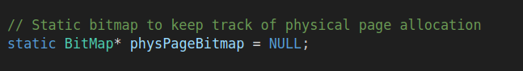
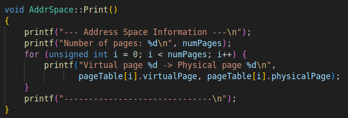
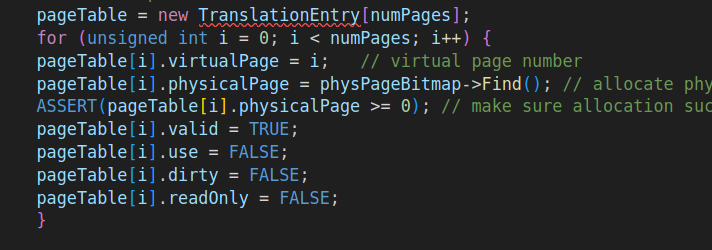
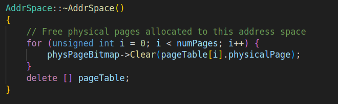
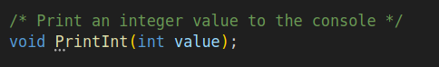
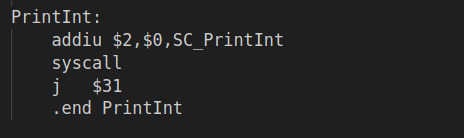
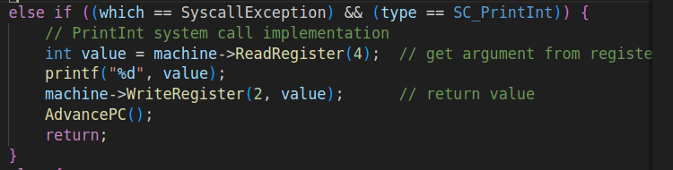

# 实验6 系统调用与多道用户程序(Lab6)

## 1.扩展现有的class AddrSpace的实现

多道用户程序指的是CPU一次读取多个程序放入内存，先运行第一个程序直到它出现了IO操作。如果系统不是多道程序，那么当我们在运行一个用户程序时就无法运行其他用户程序，那么当这个用户程序去占用IO等操作而不使用CPU时，CPU利用率会因此降低。因此，我们采用多道程序，让多个用户程序同时运行，如果一个程序不使用CPU了，那么另一个程序会占用CPU，大大提高了CPU的使用率。

在原有的Nachos实现中，地址空间是简单地将虚拟页号映射到相同的物理页号（1:1映射），这在单道程序环境中可行，但在多道程序环境中会导致地址冲突。我的思路是引入一个BitMap来管理物理内存页面的分配，确保不同程序分配到不同的物理页面。在分析原始代码时，我发现AddrSpace构造函数中的页面分配方式是固定的。

这种固定映射方式导致如果两个程序都运行，它们都会尝试使用相同的物理页面，造成内存冲突。

为了解决这个问题，我首先在addrspace.cc中引入了一个静态BitMap变量来跟踪物理页面的分配情况：



这个BitMap会在第一个AddrSpace对象创建时初始化，大小为NumPhysPages，用于标记哪些物理页面已经被分配。接下来，我修改了AddrSpace构造函数中的页面分配逻辑，将原来固定的1:1映射改为使用physPageBitmap->Find()来分配未使用的物理页面，这样每个程序都能获得不同的物理页面，避免了地址冲突。

为了便于调试和观察地址空间的分配情况，我实现了Print函数来打印当前用户程序的内存占用情况，即虚拟地址和物理地址的对应关系：



在代码段和数据段加载方面，我修改了原来的加载逻辑。原始代码直接将程序的代码和数据加载到与虚拟地址相同的物理地址，这在多道程序环境下是不可行的。我改为通过页表映射的方式加载：



对于每个字节，先计算其虚拟地址对应的虚拟页号和页内偏移，然后通过页表找到对应的物理页面，最后计算出物理地址进行加载。这样确保了用户程序的代码和数据被正确地加载到通过页表映射的物理地址。

另外，我还修改了析构函数，在地址空间销毁时释放已分配的物理页面：



这是通过遍历页表，对每个页表项调用physPageBitmap->Clear()来实现的，确保物理页面能够被回收并重新分配给其他程序使用。

Exec系统调用允许一个用户程序启动另一个用户程序，并且新程序运行在独立的地址空间中，不覆盖调用者的地址空间。我的实现思路是：当用户程序调用Exec时，系统需要创建一个新的地址空间和线程，然后将控制权转移给新程序，同时保持原程序的状态。在exception.cc的ExceptionHandler函数中，我添加了Exec系统调用的处理逻辑：

```
void
ExceptionHandler(ExceptionType which)
{
    int type = machine->ReadRegister(2);

    if ((which == SyscallException) && (type == SC_Halt)) {
        DEBUG('a', "Shutdown, initiated by user program.\n");
        interrupt->Halt();
    } 
    else if ((which == SyscallException) && (type == SC_Exec)) {
        // Exec system call implementation
        printf("Execute system call of Exec() \n");
        char filename[50];
        int addr = machine->ReadRegister(4);
        int i = 0;
        do {
            machine->ReadMem(addr + i, 1, (int *)&filename[i]);
        } while (filename[i++] != '\0');

        printf("Exec(%s):\n", filename);

        OpenFile *executable = fileSystem->Open(filename);
        if (executable == NULL) {
            printf("Unable to open file %s\n", filename);
            machine->WriteRegister(2, -1);  // return -1 on failure
            AdvancePC();
            return;
        }

        AddrSpace *space = new AddrSpace(executable);
        delete executable;

        Thread *thread = new Thread("exec thread");
        thread->space = space;

          
        // space->RestoreState();

        machine->WriteRegister(2, (int)space);  // return space pointer as ID
        AdvancePC();
        // Save current thread's user state before forking
        currentThread->SaveUserState();

        scheduler->ReadyToRun(currentThread);

        currentThread = thread;
        space->InitRegisters();  
        space->RestoreState();

        machine->Run();
        // Use Fork to properly initialize the new thread
        // Fork will automatically put the new thread on ready queue
        // thread->Fork((VoidFunctionPtr)UserThreadStart, 0);
        
        // // Put current thread on ready queue and yield
        // // scheduler->ReadyToRun(currentThread);
        // currentThread->Yield();                 // current thread yields, scheduler will pick next thread
    
    }
    else if ((which == SyscallException) && (type == SC_PrintInt)) {
        // PrintInt system call implementation
        int value = machine->ReadRegister(4);  // get argument from register r4
        printf("%d", value);
        machine->WriteRegister(2, value);      // return value
        AdvancePC();
        return;
    }
    else {
        printf("Unexpected user mode exception %d %d\n", which, type);
        ASSERT(FALSE);
    }
}
```

首先，从寄存器r4中获取文件名地址，然后使用machine->ReadMem逐字节读取文件名，直到遇到字符串结束符'\0'。接着，尝试打开指定的文件，如果文件不存在或无法打开，则返回-1表示失败。如果文件打开成功，则创建一个新的AddrSpace对象，这个对象会使用我们修改后的构造函数，通过位图分配独立的物理页面，确保与原程序不冲突。

然后，创建一个新的线程，并将新创建的地址空间关联到这个线程。初始化新线程的寄存器状态，并恢复地址空间的页表状态。将新线程加入就绪队列，同时将当前线程也加入就绪队列，最后通过interrupt->YieldOnReturn()触发线程切换，让新创建的线程开始执行。

在实现过程中，我发现系统调用后需要正确更新程序计数器，否则会导致无限循环执行同一个系统调用。因此，我实现了AdvancePC函数：


该函数读取当前PC和NextPC寄存器的值，然后更新PrevPC、PC和NextPC寄存器，确保程序能够继续执行下一条指令。

## 2.在Nachos中增加并实现PrintInt()

PrintInt系统调用的实现相对简单。首先在syscall.h中添加了系统调用号SC_PrintInt定义为11，并添加了PrintInt函数的声明：



然后在start.s中添加了PrintInt的汇编stub：



最后在exception.cc的ExceptionHandler函数中添加了PrintInt系统调用的处理逻辑：



从寄存器r4读取要打印的整数值，使用printf输出，然后将返回值写入寄存器r2，最后调用AdvancePC更新程序计数器。

## 3.实现与Unix/Linux 的fork()/exec()功能类似的Nachos系统调用Fork()/Exec()，及写时复制 (copy-on-write) 机制

在实现了多道用户程序的基础上，我探讨了在Nachos中实现与Unix/Linux的fork()/exec()功能类似的Nachos系统调用Fork()/Exec()，及写时复制机制的方法。

fork()系统调用会创建一个新的进程，子进程是父进程的副本。在Nachos中实现时，我们可以创建一个新的AddrSpace对象，并复制父进程的页表。但为了效率，可以先让父子进程共享相同的物理页面，只设置页面为只读，这就是写时复制机制。

写时复制机制的具体实现方法是：在Fork时，父进程和子进程共享相同的物理页面，在页表项中设置一个特殊标志位表示该页面是共享的。当任一进程试图写入共享页面时，会触发页面错误异常。在页面错误处理程序中，为写入进程分配新的物理页面，复制原页面内容，并更新页表，然后允许写入操作继续执行。

为了实现写时复制机制，需要扩展TranslationEntry结构，添加COW（Copy-on-Write）标志位和引用计数：

维护一个引用计数器，跟踪共享页面的进程数量，当引用计数为1且页面被写入时，直接写入；否则需要复制页面。同时，需要修改ExceptionHandler来处理页面

实现页面分配和复制的逻辑，正确管理页面引用计数和内存释放。

## 测试

为了测试多道用户程序和系统调用的实现，我编写了两个测试程序：exec.c和halt2.c。exec.c程序首先调用PrintInt打印数字12345，然后调用Exec系统调用启动halt2.noff程序，最后调用Halt系统调用停止系统。

halt2.c程序则简单地调用PrintInt打印数字67890，然后调用Halt系统调用停止系统。

测试步骤如下：

```bash
# 1. 编译测试程序
cd code/test
make 

# 2. 编译Nachos
cd ../lab6
make

# 3. 运行测试
./nachos -x ../test/exec.noff
```

輸出：

```
root@ad5b86379a87:~/sdu-se-os-design-nachos/code/lab6# ./nachos -x ../test/exec.noff
--- Address Space Information ---
Number of pages: 11
Virtual page 0 -> Physical page 0
Virtual page 1 -> Physical page 1
Virtual page 2 -> Physical page 2
Virtual page 3 -> Physical page 3
Virtual page 4 -> Physical page 4
Virtual page 5 -> Physical page 5
Virtual page 6 -> Physical page 6
Virtual page 7 -> Physical page 7
Virtual page 8 -> Physical page 8
Virtual page 9 -> Physical page 9
Virtual page 10 -> Physical page 10
------------------------------
12345Execute system call of Exec() 
Exec(../test/halt2.noff):
--- Address Space Information ---
Number of pages: 11
Virtual page 0 -> Physical page 11
Virtual page 1 -> Physical page 12
Virtual page 2 -> Physical page 13
Virtual page 3 -> Physical page 14
Virtual page 4 -> Physical page 15
Virtual page 5 -> Physical page 16
Virtual page 6 -> Physical page 17
Virtual page 7 -> Physical page 18
Virtual page 8 -> Physical page 19
Virtual page 9 -> Physical page 20
Virtual page 10 -> Physical page 21
------------------------------
67890Machine halting!

Ticks: total 48, idle 0, system 10, user 38
Disk I/O: reads 0, writes 0
Console I/O: reads 0, writes 0
Paging: faults 0
Network I/O: packets received 0, sent 0

Cleaning up...

```

第一个程序(exec.noff)启动，打印地址空间信息，显示虚拟页号到物理页号的映射关系；然后打印数字12345；接着调用Exec系统调用启动第二个程序(halt2.noff)；第二个程序启动，打印其地址空间信息，显示与第一个程序不同的物理页号映射；然后打印数字67890；最后系统停止。

通过这个测试，可以验证多道程序的正确实现：两个程序使用了不同的物理页面，但Exec系统调用能够正确启动新程序，PrintInt系统调用能够正确打印整数，整个流程符合预期。

