# 实验7：虚拟内存(Lab7)

## 实验概述

在未实现虚拟内存管理之前，Nachos在运行一个用户进程的时候，需要将程序运行所需全部内存空间一次性分配。虚拟内存实现将突破物理内存限制。本实验核心任务为根据理论学习中涉及的对换（Swapping）技术，在Lab6的基础上，设计并实现用户空间的虚拟内存管理。通过实现纯按需调页机制和页置换算法，我们能够有效管理有限的物理内存资源，支持更大的用户程序运行。

## 实验内容与实现

### 1. 纯按需调页的FIFO页置换算法实现

在实现纯按需调页的、用户进程帧数为5的FIFO页置换算法时，我们主要从StartProcess方法展开，该方法在调用-x命令后被系统调用以实现用户进程的运行。关键部分包括AddrSpace构造方法和Run之后出现异常而调用的ExceptionHandler方法。

在AddrSpace构造方法中，我们需要首先读取并计算用户进程地址空间需要的大小，随后为其分配并初始化。初始化页表和文件地址的方法分别被封装为InitPageTable()和InitInFileAddr()方法。初始化页表时，需要为页表初始化一些属性，如虚拟页号、是否dirty等。同时，如果是用户栈，需要将此页的类型修改为用户栈类型，为此我们在页表中新增type属性以便后续写入。

页错误系统调用是实现的关键。当发生页错误时，系统会调用ExceptionHandler方法新增的页错误处理逻辑。核心思想为读取出缺页寄存器中存储的地址，随后将此地址转换为虚拟页号并调用FIFO换页方法换页。具体实现如下：

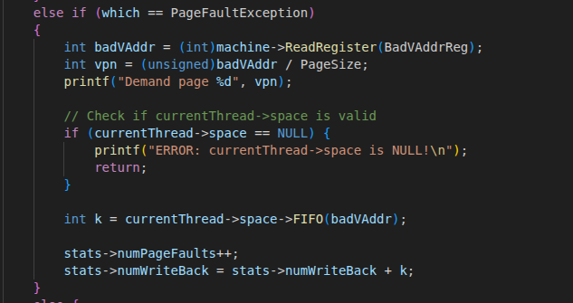

FIFO方法的实现方式主要有两个步骤：首先判断是否是最初的5个页，随后，如果是最初的5个页，我们只需要将新页写入pageTable并读取新页数据；如果不是，则调用swap方法进行页置换。

由于我们需要实现纯按需调页，而纯按需调页要求在一开始不读取页表到内存，而是在需要时发生页错误中断并调用页置换方法来实现新页的换入。对于最初的前五个页，我们不存在旧页的概念，只需通过维护一个pagenum变量，每次读入新页后加一来顺序分配前五个页的物理地址即可。

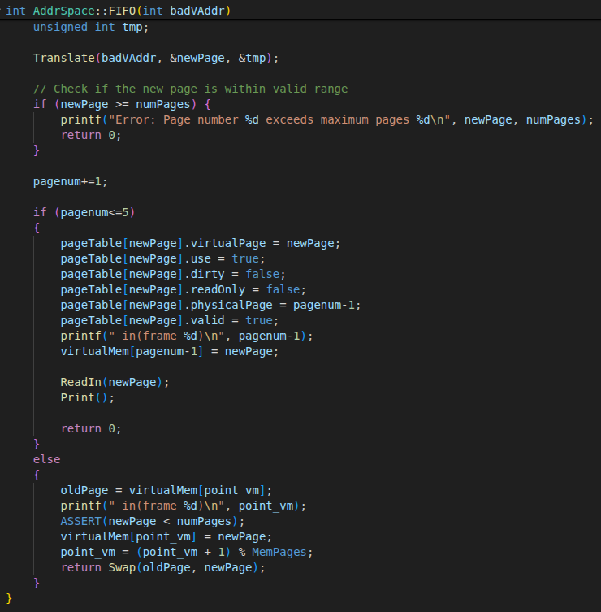

关于传统的页置换，我们需要调用Swap方法实现旧页换出和新页换入，因此在Swap中依次调用WriteBack和ReadIn方法实现上述两个功能。Swap函数返回值为WriteBack函数的返回值，也就是写回的页数目。

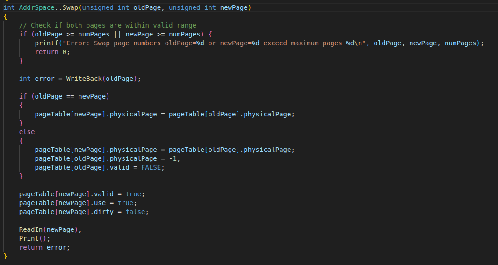

在WriteBack方法中，首先判断旧页是否为dirty，如果是的话则根据页的类型判断如何写入。对于用户栈空间和未初始化数据段，我们借用了SWAP0文件作为磁盘来写入。

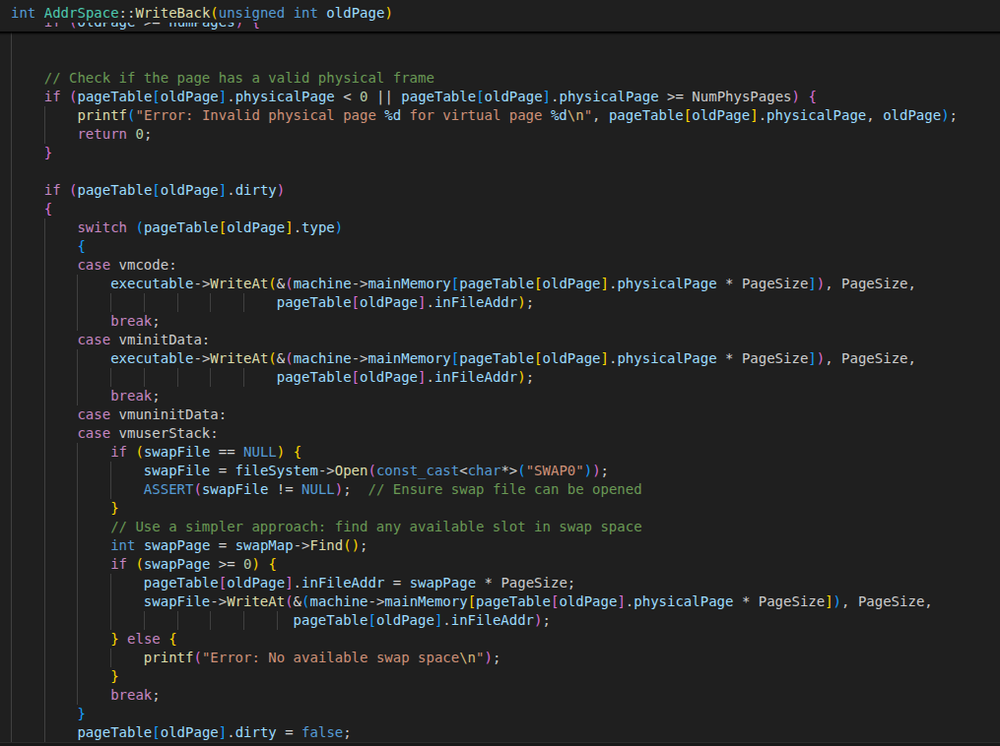

在写回后，我们在Swap方法中为初始化新页的属性，随后执行ReadIn方法。ReadIn方法的主要作用为根据不同页的类型前往不同的地址处读取文件并存储到machine的mainMemory中。

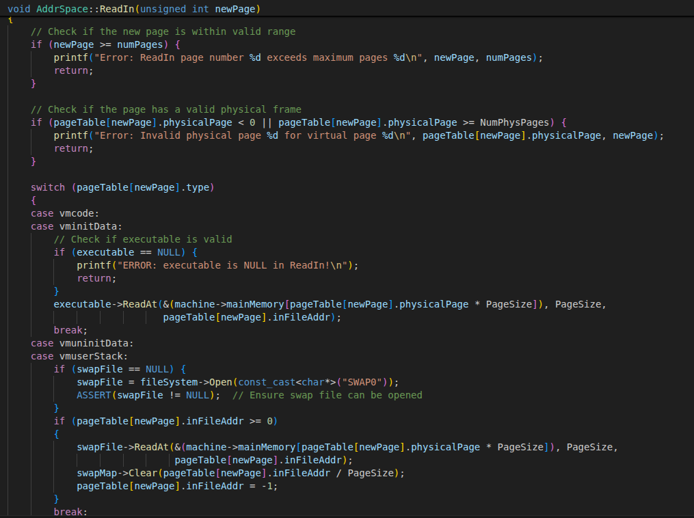

### 2. 统计信息的实现

为实现对class Statistics的调用及修改，以便在程序结束时打出页故障次数及将牺牲页写入交换空间的次数，我们在ExceptionHandler方法中，在执行完FIFO后对stats进行了两项修改：stats->numPageFaults++和stats->numWriteBack = stats->numWriteBack + k，其中k是FIFO返回值，表示是否有写回。这样在程序执行结束并调用Statistics的Print方法后，就可以打印统计信息了。

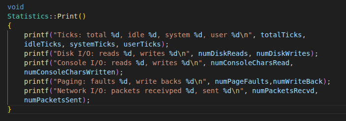

### 3. 测试结果与分析

使用lab7目录中的示例程序n7测试用户程序用同样ARRAYSIZE参数值的sort，但不同的页置换算法多次运行n7。通过测试发现，不同的页置换算法打印的ticks数确实不一样。

nachos:

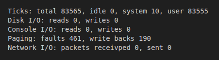

n7 1

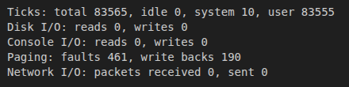

n7 2

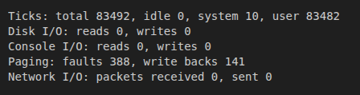

n7 3

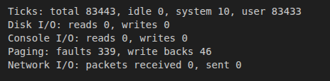

n7 4

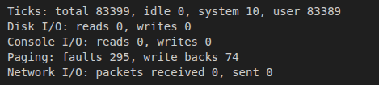

n7 5

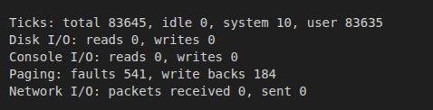

n7 6

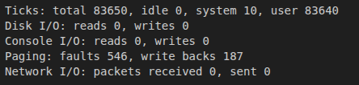

可以发现，虽然用户态执行的ticks有所不同，但是user的ticks减去page fault数量皆为一个固定值。这是因为每种页置换算法发生的页错误数不同，而每次发生页错误时需要设置PC并重新执行原来的页，所以页错误次数影响着ticks。

### 4. 最优页置换算法(OPT)实现思路

最优置换算法（OPT）是指，其所选择的被淘汰页面，将是以后永不使用的，或许是在最长(未来)时间内不再被访问的页面。采用最佳置换算法，通常可保证获得最低的缺页率。但由于人们目前还无法预知一个进程在内存的若干个页面中，哪一个页面是未来最长时间内不再被访问的，因而该算法是无法实现的，但可以利用该算法去评价其它算法。

为了得到最优页置换算法页故障次数，可以通过实现此算法的方式来完成。首先，为了完成OPT，我们需要利用其他算法获取整个程序运行流程中需要的页。根据n7readme文件的提示，示例程序实现OPT是通过存储文件REFSER0来实现的。

随后，我们开始执行OPT方法。在执行开始同样的执行，我们需要改的是出现页错误后调用的方法，我们在addrspace.cc类中新增OPT方法，当调用此方法后，我们首先使用AddrSpace::Translate方法得到需要换入的页，随后判断是否为前五个初始需要直接换入不换出的页，如果是则直接换入，如果不是，那么要找我们需要换出的页。我们首先设置一个宏变量LOOKAHEAD，表示在做换出新页决策时向前看多少个页，再增加一个大小为5的数组appearNum[]记录每个帧在后面LOOKAHEAD个页中出现的次数。然后执行循环算法，从此页的位置处向后看Translate个，每次循环体内就循环现在有的5个帧，如果看到的这个页在我们的帧上则加一，即appearNum[j]++。结束之后我们找出appearNum数组中加的次数最小的那个帧并选择将其换出，换出时执行Swap算法类似于先前的换入换出即可。

当然，我们也需要在system类中增加pagepos属性记录执行到了哪一页，并在每次读或者写页时自增。

## 总结

通过本次实验，我们成功实现了虚拟内存管理系统，包括纯按需调页机制和FIFO页置换算法。系统能够有效管理有限的物理内存资源，支持比物理内存更大的用户程序运行。实验结果表明，不同的页置换算法在性能上存在差异，这验证了算法选择对系统性能的重要性。同时，通过实现和比较不同算法，我们加深了对虚拟内存管理机制的理解。